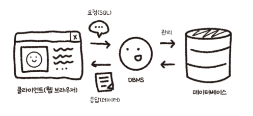

# 24.01.25
## 내용
- 0장. 개발 환경 구축하기
- 1장. 자바 백엔드 개발자가 알아두면 좋은 지식

- [저자 깃허브](https://github.com/shinsunyoung/springboot-developer)
- [교재 정오표](https://docs.google.com/spreadsheets/d/1mhsju1QRhbFmslkxD1cwxmjIkOqSW5MpZpHGeozcA6E/edit#gid=0)

---

# 0장.개발 환경 구축하기

---

 <b> build.gradle, build.gradle.kts </b> 

- `build.gradle` 파일과 `build.gradle.kts` 파일은 Gradle 빌드 시스템에서 사용되는 두 가지 다른 유형의 빌드 스크립트 파일입니다.
  - `build.gradle` 파일은 **Groovy**라는 언어로 작성됩니다. 이 파일은 프로젝트의 빌드 로직을 포함하며, 프로젝트 소스 코드가 의존하는 라이브러리를 정의합니다.
  - `build.gradle.kts` 파일은 **Kotlin DSL**을 사용하여 작성됩니다. 이 파일도 빌드 로직을 포함하지만, Kotlin 언어의 정적 타입 안전성과 IDE 지원을 활용할 수 있습니다
- 두 파일 모두 Gradle 빌드 시스템의 일부로서, 프로젝트의 빌드 및 배포 과정을 자동화하는 데 사용됩니다. 그러나 어떤 파일을 사용할지는 개발자의 선호도와 프로젝트의 요구 사항에 따라 달라집니다. 
- Kotlin DSL을 사용하면 더 강력한 정적 타입 검사와 더 나은 IDE 지원을 얻을 수 있지만, Groovy DSL은 더 간결하고 유연할 수 있습니다.

 

- __참고 링크__
  - [docs.gradle](https://docs.gradle.org/current/userguide/build_file_basics.html)
  - [우아한 기술블로그 - 'Gradle Kotlin DSL' 이야기](https://techblog.woowahan.com/2625/)

---

 <b> HTTP Method </b> 

- HTTP는 요청 메서드를 정의하여, 주어진 리소스에 수행하길 원하는 행동을 나타냅니다. 간혹 요청 메서드를 "HTTP 동사"라고 부르기도 합니다. 

- 각각의 메서드는 서로 다른 의미를 구현하지만, 일부 기능은 메서드 집합 간에 서로 공유하기도 합니다. 이를테면 응답 메서드는 [안전](https://developer.mozilla.org/ko/docs/Glossary/Safe)하거나, [캐시 가능](https://developer.mozilla.org/ko/docs/Glossary/Cacheable)하거나, [멱등성](https://developer.mozilla.org/ko/docs/Glossary/Idempotent)을 가질 수 있습니다.

- **주요 HTTP 메서드에 대한 설명**
  - `GET` : `GET` 메서드는 특정 리소스의 표시를 요청합니다. GET을 사용하는 요청은 오직 데이터를 받기만 합니다.
  - `POST` : `POST` 메서드는 특정 리소스에 엔티티를 제출할 때 쓰입니다. 이는 종종 서버의 상태의 변화나 부작용을 일으킵니다.
  - `PUT` : `PUT` 메서드는 목적 리소스 모든 현재 표시를 요청 payload로 바꿉니다.
  - `DELETE` : `DELETE` 메서드는 특정 리소스를 삭제합니다.
  - `HEAD` : `HEAD` 메서드는 `GET` 메서드의 요청과 동일한 응답을 요구하지만, 응답 본문을 포함하지 않습니다.
  - `CONNECT` : `CONNECT` 메서드는 목적 리소스로 식별되는 서버로의 터널을 맺습니다.
  - `OPTIONS` : `OPTIONS` 메서드는 목적 리소스의 통신을 설정하는 데 쓰입니다.
  - `TRACE` : `TRACE` 메서드는 목적 리소스의 경로를 따라 메시지 loop-back 테스트를 합니다.
  - `PATCH` : `PATCH` 메서드는 리소스의 부분만을 수정하는 데 쓰입니다.

- __참고 링크__
  - [mdn web docs - HTTP 요청 메서드](https://developer.mozilla.org/ko/docs/Web/HTTP/Methods)

---

# 1장. 자바 백엔드 개발자가 알아두면 좋은 지식

---

## 1.1 서버와 클라이언트
- 클라이언트(client)
  - 서버로 요청하는 프로그램.
  - ex) 웹 브라우저

- 서버(Server)
  - 클라이언트의 요청을 받아 처리하는 주체.

---

## 1.2 데이터베이스(DB)

- 여러 사람이 데이터를 한 군데에 모아놓고 여러 사람이 사용할 목적으로 관리하는 데이터 저장소.

- 클라이언트에서 SQL(즉 데이터베이스를 조작하기 위한 언어)로 데이터베이스 관리 시스템(DBMS)에 데이터를 요청하면 데이터베이스 관리 시스템은 데이터베이스에서 데이터를 꺼내 응답.

---

### 1.2.1 RDB(=Relational Database)
= 관계형 데이터베이스.
- 행(row)과 열(column)로 이루어진 테이블로 관리하며, primary key를 사용해 각 행을 식별함.
- 또한 테이블 간에 관계를 지을 수 있음

---

### 1.2.2 SQL(Structured Query Language)
데이터 검색을 하는 언어.

---

### 1.2.3 NoSQL

SQL을 안 쓴다는 의미로 사용되기도 합니다만, 최근에는 Not Only SQL의 의미로 많이 사용함.

DB 성능을 올리기 위해
- Scale Up : 머신 성능 업
- Scale Out : 머신을 여러대로 분리

RDB의 성능 향상이 어려운 문제들을 해결하기 위해 NoSQL이 등장함.

---

 

 이해 x 

책 문구 중 일부..
> 데이터베이스 성능을 높이려면 머신의 성능을 좋게 하는 스케일 업 또는 머신을 여러 대로 분리하는 스케일 아웃이라는 것이 필요합니다. 
> 스케일 업은 장비를 업그레이드하면 되지만 스케일 아웃은 데이터베이스를 분산하고, 이 때 트랜잭선을 사용하면 성능이 떨어지게 됩니다.

? 이게 뭔 소리야..

---

## 1.3 IP와 Port
- IP : 인터넷에서 컴퓨터 또는 기기들이 서로를 식별하고 통신하기 위한 주소
- Port : 그 서버에서 운용되고 있는 서비스를 구분하기 위한 번호

---

## 1.4 라이브러리와 프레임워크
- 라이브러리(Library)
  - 애플리케이션 개발에 필요한 기능인 클래스, 함수 등을 모아놓은 코드의 모음
- 프레임워크(Framework)
  - 소프트웨어 개발을 수월하게 하기 위한 소프트웨어 개발 환경

**요약**
> 프레임워크는 애플리케이션을 개발할 때 전체적인 구조를 잡기 위해 사용하는 것이고, 라이브러리는 개발을 하는 과정에서 필요한 기능을 구현하기 위해 사용하는 것.

---

## 1.5 백엔드 개발자의 업무
백엔드 개발자의 주된 업무는 서버 측 애플리케이션을 개발하는 일

대게는 아래 그림 처럼 진행함
<!-- mermaid 그림이 깨짐..-->

---

1. 과제 할당
2. 과제 분석
   - 어떤 것들을 해야 할지(+ 성능)
   - 데이터
   - 사용할 기술
   - 문제 발생 시 해결 방법 검토 등
3. 개발
   - 기능 개발
   - 버그 검토
4. 테스트
   - 코드 확인(로직, 성능, 가독성 등)
   - 단위 테스트
   - TDD

---

5. QA(Quality Assurance) 
   - 애플리케이션 품질을 높이기 위해..
6. 배포와 유지보수
   - 때에 따라서 여러 과제를 한 번에 병합해서 배포하거나, 새로운 기능이 추가될 때마다 배포함.
   - 여러 방법들이 존재 : 롤링 배포, 블루 그린 배포, 카나리 배포
   - 빌드부터 배포까지 자동화 가능 : CI(Continuous Integration)/CD(Continuous Delivery & continuous Deployment).
     - CI = 지속적인 통합: 새로운 코드 변경 사항이 정기적으로 빌드 및 테스트되어 저장소에 통합되는 것을 의미함. - 저장소에 코드가 반영되는 것을 말함.
     - CD = 지속적인 배포 - 실제 프로덕션 환경까지 변경된 코드가 반영되는 것을 의미함.

---

## 1.6 백엔드 프로그래밍 언어
백엔드에서 많이 사용하는 언어는 파이썬, C++, 자바, C#, 자바스크립트

---

## 1.7 Java annotation(자바 애너테이션)

- 자바로 작성한 코드에 추가하는 표식을 말함.
- 보통 애너테이션은 `@` 기호를 사용하며 JDK 1.5 버전부터 사용할 수 있음.
- 애너테이션은 다양한 목적으로 사용하지만 보통은 메타 데이터로 사용하는 경우가 가장 많음.

> 자바의 대표적인 애너테이션
> 
| Annotation | 설명 |
| :---: | :---: |
| `@Override` | 선언된 메서드가 오버라이드 되었음 |
| `@Deprecated` | 더 이상 사용되지 않음 |
| `@SuppressWarnings` | 컴파일 경고를 무시함 |

