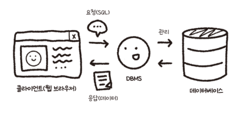
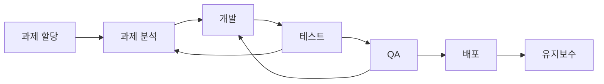

- [저자 깃허브](https://github.com/shinsunyoung/springboot-developer)
- [교재 정오표](https://docs.google.com/spreadsheets/d/1mhsju1QRhbFmslkxD1cwxmjIkOqSW5MpZpHGeozcA6E/edit#gid=0)

## Table of Contents
- [0장.개발 환경 구축하기](#0장개발-환경-구축하기)
- [1장. 자바 백엔드 개발자가 알아두면 좋은 지식](#1장-자바-백엔드-개발자가-알아두면-좋은-지식)
  - [1.1 서버와 클라이언트](#11-서버와-클라이언트)
    - [클라이언트(client)](#클라이언트client)
    - [서버(Server)](#서버server)
  - [1.2 데이터베이스(DB)](#12-데이터베이스db)
    - [1.2.1 RDB(=Relational Database)](#121-rdbrelational-database)
    - [1.2.2 SQL(Structured Query Language)](#122-sqlstructured-query-language)
    - [1.2.3 NoSQL](#123-nosql)
  - [1.3 IP와 Port](#13-ip와-port)
  - [1.4 라이브러리와 프레임워크](#14-라이브러리와-프레임워크)
    - [1.4.1 라이브러리(Library)](#141-라이브러리library)
    - [1.4.2 프레임워크(Framework)](#142-프레임워크framework)
  - [1.5 백엔드 개발자의 업무](#15-백엔드-개발자의-업무)
  - [1.6 백엔드 프로그래밍 언어](#16-백엔드-프로그래밍-언어)
  - [1.7 Java annotation(자바 애너테이션)](#17-java-annotation자바-애너테이션)
  - [마치며..](#마치며)
    - [과제](#과제)

---
 

# 0장.개발 환경 구축하기

 <b> build.gradle, build.gradle.kts </b> 

`build.gradle` 파일과 `build.gradle.kts` 파일은 Gradle 빌드 시스템에서 사용되는 두 가지 다른 유형의 빌드 스크립트 파일입니다.

- `build.gradle` 파일은 **Groovy**라는 언어로 작성됩니다. 이 파일은 프로젝트의 빌드 로직을 포함하며, 프로젝트 소스 코드가 의존하는 라이브러리를 정의합니다.

- `build.gradle.kts` 파일은 **Kotlin DSL**을 사용하여 작성됩니다. 이 파일도 빌드 로직을 포함하지만, Kotlin 언어의 정적 타입 안전성과 IDE 지원을 활용할 수 있습니다

두 파일 모두 Gradle 빌드 시스템의 일부로서, 프로젝트의 빌드 및 배포 과정을 자동화하는 데 사용됩니다. 그러나 어떤 파일을 사용할지는 개발자의 선호도와 프로젝트의 요구 사항에 따라 달라집니다. 

Kotlin DSL을 사용하면 더 강력한 정적 타입 검사와 더 나은 IDE 지원을 얻을 수 있지만, Groovy DSL은 더 간결하고 유연할 수 있습니다.

__참고 링크__
- [docs.gradle](https://docs.gradle.org/current/userguide/build_file_basics.html)
- [우아한 기술블로그 - 'Gradle Kotlin DSL' 이야기](https://techblog.woowahan.com/2625/)

 

 <b> HTTP Method </b> 

HTTP는 요청 메서드를 정의하여, 주어진 리소스에 수행하길 원하는 행동을 나타냅니다. 간혹 요청 메서드를 "HTTP 동사"라고 부르기도 합니다. 

각각의 메서드는 서로 다른 의미를 구현하지만, 일부 기능은 메서드 집합 간에 서로 공유하기도 합니다. 이를테면 응답 메서드는 [안전](https://developer.mozilla.org/ko/docs/Glossary/Safe)하거나, [캐시 가능](https://developer.mozilla.org/ko/docs/Glossary/Cacheable)하거나, [멱등성](https://developer.mozilla.org/ko/docs/Glossary/Idempotent)을 가질 수 있습니다.

**주요 HTTP 메서드에 대한 설명**
- `GET` : `GET` 메서드는 특정 리소스의 표시를 요청합니다. GET을 사용하는 요청은 오직 데이터를 받기만 합니다.
- `POST` : `POST` 메서드는 특정 리소스에 엔티티를 제출할 때 쓰입니다. 이는 종종 서버의 상태의 변화나 부작용을 일으킵니다.
- `PUT` : `PUT` 메서드는 목적 리소스 모든 현재 표시를 요청 payload로 바꿉니다.
- `DELETE` : `DELETE` 메서드는 특정 리소스를 삭제합니다.
- `HEAD` : `HEAD` 메서드는 `GET` 메서드의 요청과 동일한 응답을 요구하지만, 응답 본문을 포함하지 않습니다.
- `CONNECT` : `CONNECT` 메서드는 목적 리소스로 식별되는 서버로의 터널을 맺습니다.
- `OPTIONS` : `OPTIONS` 메서드는 목적 리소스의 통신을 설정하는 데 쓰입니다.
- `TRACE` : `TRACE` 메서드는 목적 리소스의 경로를 따라 메시지 loop-back 테스트를 합니다.
- `PATCH` : `PATCH` 메서드는 리소스의 부분만을 수정하는 데 쓰입니다.

__참고 링크__
- [mdn web docs - HTTP 요청 메서드](https://developer.mozilla.org/ko/docs/Web/HTTP/Methods)

 

# 1장. 자바 백엔드 개발자가 알아두면 좋은 지식
## 1.1 서버와 클라이언트
### 클라이언트(client)
서버로 요청하는 프로그램.

ex) 웹 브라우저

### 서버(Server)
클라이언트의 요청을 받아 처리하는 주체.

## 1.2 데이터베이스(DB)
여러 사람이 데이터를 한 군데에 모아놓고 여러 사람이 사용할 목적으로 관리하는 데이터 저장소.

- 클라이언트에서 SQL(즉 데이터베이스를 조작하기 위한 언어)로 데이터베이스 관리 시스템(DBMS)에 데이터를 요청하면 데이터베이스 관리 시스템은 데이터베이스에서 데이터를 꺼내 응답.

### 1.2.1 RDB(=Relational Database)
관계형 데이터베이스.
- 행(row)과 열(column)로 이루어진 테이블로 관리하며, primary key를 사용해 각 행을 식별함.
- 또한 테이블 간에 관계를 지을 수 있음

### 1.2.2 SQL(Structured Query Language)
데이터 검색을 하는 언어.

### 1.2.3 NoSQL
SQL을 안 쓴다는 의미로 사용되기도 합니다만, 최근에는 Not Only SQL의 의미로 많이 사용함.

DB 성능을 올리기 위해
- Scale Up : 머신 성능 업
- Scale Out : 머신을 여러대로 분리

RDB의 성능 향상이 어려운 문제들을 해결하기 위해 NoSQL이 등장함.

책 문구 중 일부..
> 데이터베이스 성능을 높이려면 머신의 성능을 좋게 하는 스케일 업 또는 머신을 여러 대로 분리하는 스케일 아웃이라는 것이 필요합니다. 
> 스케일 업은 장비를 업그레이드하면 되지만 스케일 아웃은 데이터베이스를 분산하고, 이 때 트랜잭선을 사용하면 성능이 떨어지게 됩니다.

? 이게 뭔 소리야..

## 1.3 IP와 Port
IP : 인터넷에서 컴퓨터 또는 기기들이 서로를 식별하고 통신하기 위한 주소
Port : 그 서버에서 운용되고 있는 서비스를 구분하기 위한 번호

## 1.4 라이브러리와 프레임워크

### 1.4.1 라이브러리(Library)
- 애플리케이션 개발에 필요한 기능인 클래스, 함수 등을 모아놓은 코드의 모음

### 1.4.2 프레임워크(Framework)
- 소프트웨어 개발을 수월하게 하기 위한 소프트웨어 개발 환경

**요약**
> 프레임워크는 애플리케이션을 개발할 때 전체적인 구조를 잡기 위해 사용하는 것이고, 라이브러리는 개발을 하는 과정에서 필요한 기능을 구현하기 위해 사용하는 것.

## 1.5 백엔드 개발자의 업무
백엔드 개발자의 주된 업무는 서버 측 애플리케이션을 개발하는 일

대게는 아래 그림 처럼 진행함

1. 과제 할당
2. 과제 분석
   - 어떤 것들을 해야 할지(+ 성능)
   - 데이터
   - 사용할 기술
   - 문제 발생 시 해결 방법 검토 등
3. 개발
   - 기능 개발
   - 버그 검토
4. 테스트
   - 코드 확인(로직, 성능, 가독성 등)
   - 단위 테스트
   - TDD
5. QA(Quality Assurance) 
   - 애플리케이션 품질을 높이기 위해..
6. 배포와 유지보수
   - 때에 따라서 여러 과제를 한 번에 병합해서 배포하거나, 새로운 기능이 추가될 때마다 배포함.
   - 여러 방법들이 존재 : 롤링 배포, 블루 그린 배포, 카나리 배포
   - 빌드부터 배포까지 자동화 가능 : CI(Continuous Integration)/CD(Continuous Delivery & continuous Deployment).
     - CI = 지속적인 통합: 새로운 코드 변경 사항이 정기적으로 빌드 및 테스트되어 저장소에 통합되는 것을 의미함. - 저장소에 코드가 반영되는 것을 말함.
     - CD = 지속적인 배포 - 실제 프로덕션 환경까지 변경된 코드가 반영되는 것을 의미함.

## 1.6 백엔드 프로그래밍 언어
백엔드에서 많이 사용하는 언어는 파이썬, C++, 자바, C#, 자바스크립트

## 1.7 Java annotation(자바 애너테이션)
자바로 작성한 코드에 추가하는 표식을 말함.

보통 애너테이션은 `@` 기호를 사용하며 JDK 1.5 버전부터 사용할 수 있음.

애너테이션은 다양한 목적으로 사용하지만 보통은 메타 데이터로 사용하는 경우가 가장 많음.

> 자바의 대표적인 애너테이션

| Annotation | 설명 |
| :---: | :---: |
| `@Override` | 선언된 메서드가 오버라이드 되었음 |
| `@Deprecated` | 더 이상 사용되지 않음 |
| `@SuppressWarnings` | 컴파일 경고를 무시함 |

## 마치며..
### 과제
1. 스프링부트 3 백엔드 개발자 되기 2장까지 공부
2. 2장의 주요 개념 IoC(DI), WAS, Bean 조사 및 설명 준비하기
   - IoC(DI): 홍진기
   - Bean: 정영훈
   - WAS: 고성빈
3. 정영훈: NoSQL 관련해서 답변한 내용이 맞는지 조사해보기
4. 조성빈: 다양한 빈 선언 방법 조사해와서 발표하기
   - application.xml
   - @configuration에서 @Bean 사용
   - 클래스 위에 @Component, @Controller, @Service 등

