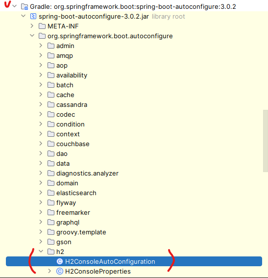

## Table of Contents
- [2장. 스프링 부트 3 시작하기](#2장-스프링-부트-3-시작하기)
  - [2.1 스프링과 스프링 부트](#21-스프링과-스프링-부트)
    - [2.1.1 스프링의 등장](#211-스프링의-등장)
    - [2.1.2 스프링을 더 쉽게 만들어주는 스프링 부트](#212-스프링을-더-쉽게-만들어주는-스프링-부트)
  - [2.2 스프링 콘셉트 공부하기](#22-스프링-콘셉트-공부하기)
    - [2.2.1 제어의 역전과 의존성 주입](#221-제어의-역전과-의존성-주입)
      - [IoC(Inversion of Control)란?](#iocinversion-of-control란)
      - [DI(Dependency Injection)란?](#didependency-injection란)
    - [2.2.2 빈과 스프링 컨테이너](#222-빈과-스프링-컨테이너)
      - [스프링 컨테이너란?](#스프링-컨테이너란)
      - [빈이란?](#빈이란)
    - [2.2.3 관점 지향 프로그래밍(AOP, Aspect Oriented Programming)](#223-관점-지향-프로그래밍aop-aspect-oriented-programming)
    - [2.2.4 이식 가능한 서비스 추상화(PSA, Portable Service Abstraction)](#224-이식-가능한-서비스-추상화psa-portable-service-abstraction)
    - [한 줄로 정리](#한-줄로-정리)
  - [2.3 스프링 부트 3 둘러보기](#23-스프링-부트-3-둘러보기)
    - [2.3.1 첫 번째 스프링 부트 3 예제 만들기](#231-첫-번째-스프링-부트-3-예제-만들기)
    - [2.3.2 스프링 부트 스타터 살펴보기](#232-스프링-부트-스타터-살펴보기)
    - [2.3.3 자동 구성](#233-자동-구성)
    - [2.3.4 스프링 부트3와 자바 버전](#234-스프링-부트3와-자바-버전)
      - [**테스트 블록**](#테스트-블록)
      - [**`formatted()` 메서드**](#formatted-메서드)
      - [**레코드**](#레코드)
      - [**패턴 매칭**](#패턴-매칭)
      - [**자료형에 맞는 case 처리**](#자료형에-맞는-case-처리)
      - [**Servlet, JAP의 네임 스페이스가 Jakarta로 대체**](#servlet-jap의-네임-스페이스가-jakarta로-대체)
      - [GraalVM 기반의 스프링 네이티브 공식 지원](#graalvm-기반의-스프링-네이티브-공식-지원)
  - [2.4 스프링 부트 3 코드 이해하기](#24-스프링-부트-3-코드-이해하기)
    - [2.4.1 `@SpringBootApplication` 이해하기](#241-springbootapplication-이해하기)
    - [2.4.2 테스트 컨트롤러 살펴보기](#242-테스트-컨트롤러-살펴보기)
  - [핵심 요약](#핵심-요약)


# 2장. 스프링 부트 3 시작하기
- **학습 목표:** 스프링 부트3의 상위 프레임워크인 스프링을 비교하며 스프링 부트3에 대해 알아보고, 스프링의 콘셉트인 IoC(제어의 역전), DI(의존성 주입), AOP(관점 지향 프로그래밍), PSA(이식 가능한 서비스 추상화)를 알아본 다음 스프링 부트 3 프로젝트를 만들며 스프링 부트3를 시작해보겠습니다.

- **핵심 키워드**
  - IoC(제어의 역전)
  - DI(의존성 주입)
  - AOP(관점 지향 프로그래밍)
  - PSA(이식 가능한 서비스 추상화)


## 2.1 스프링과 스프링 부트
- 스프링 프레임워크
- 스프링 부트

### 2.1.1 스프링의 등장
- 엔터프라이즈 애플리케이션 : 대구모의 복잡한 데이터를 관리하는 애플리케이션.
  - 서버 성능과 안정성, 보안이 중요
  - $+$ 비즈니스 로직(사이트 기능) 개발

- 2003년 6월에 스프링 프레임워크 등장
  - 덕분에 개발자들은 기능 개발에 집중할 수 있게 됨!

### 2.1.2 스프링을 더 쉽게 만들어주는 스프링 부트
- 스프링은 장점이 많지만 설정이 매우 복잡. 

- 그래서 스프링 개발팀에서도 이런 단점을 보완하고자 스프링 부트를 출시(2013년 4월 0.5.0.M6 버전 첫 공개).

- 스프링 부트의 주요 특징
  - 톰캣, 제티, 언더토우 같은 웹 애플리케이션 서버(web application server, WAS)가 내장되어 있어서 따로 설치를 하지 않아도 독립적으로 실행할 수 있습니다.
  - 빌드 구성을 단순화하는 스프링 부트 스타터 제공
  - XML 설정을 하지 않고 자바 코드로 모두 작성 가능
  - JAR을 이용해서 자바 옵션만으로도 배포 가능
  - 애플리케이션의 모니터링 및 관리 도구인 스프링 액츄에이터(spring actuator)를 제공합니다.

- 스프링 부트와 스프링의 차이점
  - **구성**
    - 스프링 : 개발에 필요한 환경을 수동으로 구성하게 정의해야 함
    - 스프링 부트 : 스프링 코어와 스프링 MVC의 모든 기능을 자동으로 로드하므로 수동으로 개발 환경을 구성할 필요가 없음.
  - **내장 WAS의 유무**
    - WAS란 간단히 웹 애플리케이션을 실행하기 위한 장치
    - 스프링 부트는 WAS를 자체적으로 가지고 있음, 스프링은 그렇지 않음.
  - 그 외 특징 비교
  
  | | 스프링 | 스프링 부트 |
  | --- | :---: | :---: |
  | 목적 | 엔터프라이즈 애플리케이션 개발을 더 쉽게 만들기 | 스프링의 개발을 더 빠르고 쉽게 하기 |
  | 설정 파일 | 개발자가 수동으로 구성 | 자동 구성 |
  | XML | 일부 파일은 XML로 직접 생성하고 관리 | 사용하지 않음 |
  | 인메모리 데이터베이스 지원 | 지원하지 않음 | 인메모리 데이터베이스 자동 설정 지원 |
  | 서버 | 프로젝트를 띄우는 서버(예: 톰캣, 제티)를 별도로 수동 설정 | 내장형 서버를 제공해 별도의 설정이 필요 없음 |

## 2.2 스프링 콘셉트 공부하기
- 제어의 역전(IoC)
- 의존성 주입(DI)
- 스프링 컨테이너
- 빈

### 2.2.1 제어의 역전과 의존성 주입
스프링은 모든 기능의 기반을 제어의 역전(IoC)와 의존성 주입(DI)에 두고 있음.

#### IoC(Inversion of Control)란?
지금까지의 자바 : 코드를 작성해 객체를 생성할 때는 객체가 필요한 곳에서 직접 생성했을 것임.(아래 코드는 클래스 B 객체를 사용하기 위해 클래스 A에서 객체를 직접 생성함)
```java
public class A {
  b = new B(); // 클래스 A에서 new 키워드로 클래스 B의 객체 생성
}
```

> 제어의 역전은 다른 객체를 직접 생성하거나 제어하는 것이 아니라 외부에서 관리하는 객체를 가져와 사용하는 것을 말함.

> 실제로 스프링은 스프링 컨테이너가 객체를 관리, 제공하는 역할을 함.

```java
// 제어의 역전을 적용한 코드
public class A {
  private B b; // 코드에서 객체를 생성하지 않음, 어디선가 받아온 객체를 b에 할당.
}
```

#### DI(Dependency Injection)란?
스프링에서는 객체들을 관리하기 위해 제어의 역전을 사용함.

그리고 제어의 역전을 구현하기 위해 사용하는 방법이 DI.

DI는 어떤 클래스가 다른 클래스에 의존한다는 뜻임.

▼ 객체를 주입받는 모습 예
```java
public class A {
  // A에서 B를 주입받음
  @Autowired // 스프링 컨테이너에 있는 빈이라는 것을 주입하는 역할
  B b; // B가 빈.
}
```


즉, 기존의 자바 코드는 클래스 A에서 B 객체를 쓰고 싶은 경우 직접 생성했지만, 스프링의 경우 클래스 A에서 B 객체를 쓰고 싶은 경우 객체를 직접 생성하는 것이 아니라 스프링 컨테이너에서 객체를 주입받아 사용함.


### 2.2.2 빈과 스프링 컨테이너
#### 스프링 컨테이너란?
스프링은 스프링 컨테이너를 제공함.

스프링 컨테이너는 빈을 생성하고 관리함.(즉, 빈이 생성되고 소멸되기까지의 생명주기를 이 스프링 컨테이너가 관리하는 것)

#### 빈이란?
스프링 컨테이너가 생성하고 관리하는 객체.(어렵게 생각할 필요 없이 스프링에서 제공해주는 객체라고 생각하기)

등록하기 위한 방법
1. XML 파일 설정
2. 애너테이션 추가
3. 등..

▼ 클래스를 빈으로 등록하는 방법 예
```java
@Component // 클래스 MyBean 빈으로 등록 - 이 후 스프링 컨테이너에서 이 클래스를 관리함.
public class MyBean {
}
```

### 2.2.3 관점 지향 프로그래밍(AOP, Aspect Oriented Programming)
프로그래밍에 대한 관심을 핵심 관점, 부가 관점으로 나누어서 관심 기준으로 모듈화하는 것을 의미함.

**예시**  
계좌 이체, 고객 관리하는 프로그램.
- 핵심 관점 : 계좌 이체, 고객 관리 로직
- 부가 관점 : 로깅, 데이터베이스 연결 로직


로깅, 데이터베이스 연결은 모두 계좌 이체와 고객 관리에 필요함. 여기에 AOP 관점을 적용하면 부가 관점에 해당하는 로직을 모듈화해 앞에서 본 그림처럼 개발할 수 있게 해줌.

> 부가 관점 코드를 핵심 관점 코드에서 분리할 수 있다. 그 결과 프로그래머는 **핵심 관점 코드에만 집중이 가능**하고 프로그램의 변경과 확장에도 유연하게 대응이 가능하다.

### 2.2.4 이식 가능한 서비스 추상화(PSA, Portable Service Abstraction)
스프링에서 제공하는 다양한 기술들을 추상화해 개발자가 쉽게 사용하는 인터페이스를 말함.

예시)
- 클라이언트의 매핑과 클래스
- 메서드의 매핑을 위한 애너테이션

> 스프링 프레임워크는 IoC/DI를 통해 객체 간의 의존 관계를 설정하고, AOP를 통해 핵심 관점과 부가 로직을 분리해 개발하며, PSA를 통해 추상화된 다양한 서비스들을 일관된 방식으로 사용하도록 함.


### 한 줄로 정리
- IoC(Inversion of Control) : 객체의 생성과 관리를 개발자가 하는 것이 아니라 프레임워크가 대신하는 것
- DI(Dependency Injection) : 외부에서 객체를 주입받아 사용하는 것
- AOP(Aspect Oriented Programming) : 프로그래밍을 할 때 핵심 관점과 부가 관점을 나누어서 개발하는 것
- PSA(Portable Service Abstraction) : 어느 기술을 사용하던 일관된 방식으로 처리하도록 하는 것

## 2.3 스프링 부트 3 둘러보기

### 2.3.1 첫 번째 스프링 부트 3 예제 만들기
- 루프백 호스트명
  - `http://localhost`
  - $127.0.0.1$

```text
http://localhost:8080/test
localhost: 현재 사용중인 컴퓨터
8080: 포트 번호
test: 경로
```
웹 브라우저에서 요청할 주소에 맞게 코드를 작성하면 웹 사이트나, 웹 애플리케이션을 개발할 수 있음.

### 2.3.2 스프링 부트 스타터 살펴보기
스타터는 spring-boot-starter-{작업유형}이라는 명명규칙이 있음.

자주 사용하는 스타터
| 스타터 | 설명 |
| --- | --- |
| spring-boot-starter-web | Spring MVC를 사용해서 RESTful 웹 서비스를 개발할 때 필요한 의존성 모음 |
| spring-boot-starter-test | 스프링 애플리케이션을 테스트하기 위해 필요한 의존성 모음 |
| spring-boot-starter-validation | 유효성 검사를 위해 필요한 의존성 모음 |
| spring-boot-starter-actuator | 모니터링을 위해 애플리케이션에서 제공하는 다양한 정보를 제공하기 쉽게 하는 의존성 모음 |
| spring-boot-starter-data-jpa | ORM을 사용하기 위한 인터페이스의 모음인 JPA를 더 쉽게 사용하기 위한 의존성 모음 |

전에 우리가 설정했던 build.gradle.kts
```kotlin
dependencies {
  implementation("org.springframework.boot:spring-boot-starter-web") // web starter
  testImplementation("org.springframework.boot:spring-boot-starter-test") // test starter
}
```

스프링 부트 의존성 확인 링크들..
- [Dependency Versions](https://docs.spring.io/spring-boot/docs/current/reference/html/dependency-versions.html)
- [github - spring-projects/spring-boot](https://github.com/spring-projects/spring-boot)

### 2.3.3 자동 구성
스프링 부트에서는 애플리케이션이 최소한의 설정만으로도 실행되게 여러 부분을 자동으로 구성함.

> 지금 이것을 알아야 하는 이유는 내가 구성하지 않은 부분인데 스프링에서 자동으로 어떻게 구성했는지 확인해야 할 상황이 오기 때문임.

스프링 부트는 서버를 시작할 때 구성 파일을 읽어와서 설정하며, 이를 자동 설정이라 함.

자동 설정은 META-INF에 있는 spring.factories 파일에 담겨 있음.
- 이 파일에 적힌 내용이 프로젝트에 쓰일 구성 후보들임.
- 스프링 부트를 시작할 때 이 파일에 설정된 클래스는 모두 블로오고, 이후에는 프로젝트에서 사용할 것들만 자동으로 구성해 등록함.

미리 구현되어 있는 자동 설정 파일 확인

- 자동 구성되는 클래스는 AutoConfiguration을 이름 끝에.
- 속성값을 정의해놓은 클래스는 Properties를 이름 끝에 붙였음을 알 수 있음.  

스프링 부트에서는 빈이 자동으로 등록되고 구성됨. 만약 자동 구성이 없다면 개발자가 특정 기술을 사용할 때마다 설정해야 하는 값을 모두 개발자가 직접 설정해줘야 함.

### 2.3.4 스프링 부트3와 자바 버전
스프링 부트2는 자바 8버전 이상을 사용했지만, 스프링 부트3은 자바 17버전 이상을 사용해야 함.

자바 17의 주요 변화인 텍스트 블록, 레코드, 패턴 매칭 등을 살펴보겠음.

#### **테스트 블록**
이전에는 여러 줄의 텍스트를 작성하려면 `\n`을 추가해야 했지만, 이제는 `"""`로 감싼 텍스트를 사용해 여러 줄의 텍스트를 표현 가능
```java
String query11 = "SELECT * FROM \"items\"\n" +
      "WHERE \" status\" = \"ON_SALE\"\n" +
      "ORDER BY \" price\"; \n";

String query17 = """
                SELECT * FROM "items"
                WHERE "status" = "ON_SALE"
                ORDER BY "price";
                """;
```

#### **`formatted()` 메서드**  
또한 값을 파싱하기 위한 `formatted()` 메서드도 제공함.
```java
String textBlock17 = """
{
  "id": %d
  "name": %s,
}
""".formatted(2, "juice");
```

#### **레코드**  
데이터 전달을 목적으로 하는 객체를 더 빠르고 간편하게 만들기 위한 기능. 레코드는 상속을 할 수 없고 파라미터에 정의한 필드는 `private final`로 정의됨. 또한 레코드는 getter를 자동으로 만들기 때문에 애너테이션이나 메서드로 getter 정의를 하지 않아도 됨.
```java
record Item(String name, int price) {
  // 이렇게 하면 파라미터가 private final로 정의됨
}
Item juice = new Item("juice", 3000);
juice.price(); // 3000
```

#### **패턴 매칭**
타입 확인을 위해 사용하던 `instanceof` 키워드를 조금 더 쉽게 사용할 수 있게 해줌. 이전과는 다르게 바로 형변환을 한 다음 사용할 수 있음.
```java
// 11 버전
if(o instanceof Integer) {
  Integer i = (Integer) o;
  // ...
}

// 17 버전
if(o instanceof Integer i) {
  // ...
}
```

#### **자료형에 맞는 case 처리**
`switch-case`문으로 자료형에 맞게 case 처리를 할 수도 있음.
```java
static double getIntegerValue(Object o) {
  return switch(o) {
    case Double d -> d.intValue();
    case Float f -> f.intValue();
    case String s => Integer.parseInt(s);
    default -> 0d;
  };
}
```

#### **Servlet, JAP의 네임 스페이스가 Jakarta로 대체**
패키지 네임스페으스가 `javax.*`에서 `jakarta.*`로 변경됨.

#### GraalVM 기반의 스프링 네이티브 공식 지원
GraalVM 네이티브 이미지를 공식 지원. 기존에 사용하던 JVM에 비해 훨씬 빠르게 시작하며 더 적은 메모리 공간을 차지. JVM 실행 파일과 비교해 네이티브 이미지를 사용하면 가동 시간이 짧아지고 메모리를 더 적게 소모함.

## 2.4 스프링 부트 3 코드 이해하기

### 2.4.1 `@SpringBootApplication` 이해하기
- **SpringBootDeveloperApplication.java**

```java
@SpringBootApplication // 스프링 부트 사용에 필요한 기본 설정
public class SpringBootDeveloperApplication {
  public static void main(String[] args) {
    SpringApplication.run(SpringBootDeveloperApplication.class, args); // 애플리케이션 실행
  }
}
```
이 클래스는 자바의 `main()`메서드와 같은 역할. 즉, 여기서 스프링 부트가 시작됨.

`@SpringBootApplication` - SpringBootApplication.java
```java
@Target({ElementType.TYPE})
@Retention(RetentionPolicy.RUNTIME)
@Documented
@Inherited
@SpringBootConfiguration // 스프링 부트 관련 설정
@EnableAutoConfiguration // 자동으로 등록된 빈을 읽고 등록
@ComponentScan(
    excludeFilters = {@Filter(
    type = FilterType.CUSTOM, // 사용자가 등록한 빈을 읽고 등록
    classes = {TypeExcludeFilter.class}
), @Filter(
    type = FilterType.CUSTOM,
    classes = {AutoConfigurationExcludeFilter.class}
)}
)
public @interface SpringBootApplication {
    // ...
}
```
`@SpringBootConfiguration`
- 스프링 부트 관련 설정을 나타내는 애너테이션
- `@Configuration`을 상속해서 만든 애너테이션
- 개발자가 직접 사용하는 애너테이션은 아님

`@ComponentScan`
- 사용자가 등록한 빈을 읽고 등록하는 애너테이션
- `@Component`라는 애너테이션을 가진 클래스들을 찾아 빈으로 등록하는 역할을 함.
- `@Component`를 감싸는 애너테이션도 존재 - 용도에 따라 다른 애너테이션을 사용함.

| 애너테이션명 | 설명 |
| :--- | :--- |
| `@Configuraiton` | 설정 파일 등록 |
| `@Repository` | ORM 매핑 |
| `@Controller, @RestController` | 라우터 |
| `@Service` | 비즈니스 로직 |

`@EnableAutoConfiguration`
- 스프링 부트에서 자동 구성을 활성화하는 애너테이션.
- 스프링 부트 서버가 실행될 때 스프링 부트의 메타 파일을 읽고 정의된 설정들을 자동으로 구성하는 역할을 수행함.
- spring.factories에 있는 클래스들이 모두 `@EnableAutoConfiguration`을 사용할 때 자동 설정됨.


### 2.4.2 테스트 컨트롤러 살펴보기
실제로 작성한 TestController.java를 보며 빈이 어떻게 등록되는지 알아보자.

```java
@RestController
public class TestController {
  @GetMapping("/test") // /test GET 요청이 오면 test() 메서드 실행
  public String test() {
    return "Hello, world!";
  }
}
```

`@RestController`: 라우터 역할을 하는 애너테이션
- 라우터: HTTP 요청과 메서드를 연결하는 장치
- 이 애너테이션이 있어야 클라이언트의 요청에 맞는 메서드를 실행할 수 있음.

`@RestController`와 `@Component`는 애너테이션 용어가 다른데 어떻게 같은 `@Component`처럼 취급하는 것일까?

RestController.java
```java
@Target({ElementType.TYPE})
@Retention(RetentionPolicy.RUNTIME)
@Documented
@Controller
@ResponseBody
public @interface RestController {
    @AliasFor(
        annotation = Controller.class
    )
    String value() default "";
}
```
`@Controller` 애너테이션에 `@ResponseBody` 애너테이션이 합쳐진 결과물이 `@RestController` 애너테이션임을 알 수 있음.

Controller.java
```java
// 직접 쳐서 오타가 있을지도..
@Target({ElementType.TYPE})
@Retention(RetentionPolicy.RUNTIME)
@Documented
@Component
public @interface Controller {
  @AliasFor(
      annotation = Component.class
  )
  String value() default "";
}
```
여기에 `@Component` 애너테이션이 있음을 알 수 있음.

`@Controller` 애너테이션에서 `@Component` 애너테이션을 가지고 있기 때문에 `@Controller` 애너테이션이 `@ComponentScan`을 통해 빈으로 등록되는 것..

앞서 소개한 `@Configuration`, `@Repository`, `@Service` 애너테이션도 모두 `@Component` 애너테이션을 가지고 있음.(그래서 `@ComponentScan`을 통해 빈으로 등록되는 것)

## 핵심 요약
1. ***스프링***은 엔터프라이즈 애플리케이션을 쉽게 개발할 수 있도록 도와주는 프레임워크
2. ***IoC***는 제어의 역전, ***DI***는 의존성 주입을 뜻함
3. ***스프링 부트***는 스프링을 더 빠르고 쉽게 사용하기 위한 도구로서 스타터와 자동 구성을 제공함.
4. ***애너테이션***은 자바 소스 코드에 추가하는 표식임. 보통 `@` 기호를 앞에 붙여서 사용하며, JDK 1.5 버전부터 사용할 수 있음. 애너테이션은 다양한 목적으로 사용하지만, 메터 데이터(데이터에 대한 설명을 담고 있는 데이터)의 비중이 가장 큼.
5. ***`@SpringBootApplication`***은 스프링 부트 관련된 설정을 하는 `@SpringBootConfiguration`, 사용자가 등록한 빈을 읽고 등록하는 `@ComponentScan`, 자동 설정으로 등록되는 빈을 읽고 등록하는 `@EnableAutoConfiguration`으로 이루어져 있음.
6. ***`@Component`*** 애너테이션이 있는 클래스는 빈으로 등록되며, `@Controller`, `@RestController`, `@Configuration`, `@Repository`, `@Service` 모두 `@Component` 애너테이션을 가지고 있음. 때에 따라 알맞은 애너테이션을 선택해야 함!

