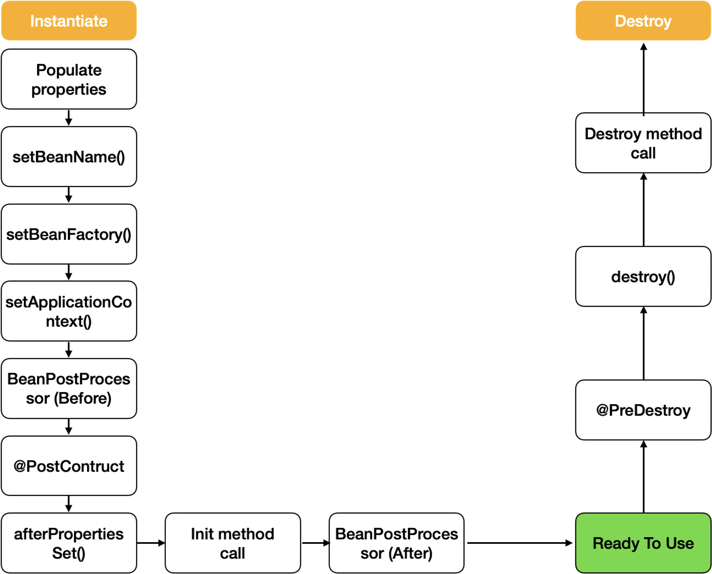

# Spring Bean


## 개념

Spring에서는 **Spring Container**, **IoC Container**라는 개념을 사용한다.

Container는 **인스턴스의 생명주기를 관리**하며, **생성된 인스턴스들에게 추가적인 기능을 제공하도록 하는 것**이다.

즉 Container는 개발자가 작성한 코드의 처리과정을 위임받은 독립적인 존재라고 생각하면 된다.

Container는 적절한 설정만 되어있다면 누구의 도움 없이도 작성한 코드를 스스로 참조한 뒤 **알아서 객체의 생성과 소멸을 컨트롤**해준다.

**Spring Container는 Spring Framework의 핵심부에 위치하며, 종속 객체 주입을 이용하여 Application을 구성하는 Component들을 관리**한다.

이때 **Spring Container에서 생성되는 객체**를 **Bean**이라고 한다.

## Bean
> Bean은 **Spring IoC Container가 관리하는 자바 객체(POJO, Plain Old Java Object), Spring Bean Container에 존재하는 객체**를 말한다.

- Spring IoC(Inversion of Control) Contatiner에 의해 인스턴스화, 관리, 생성된다.
- Bean Container는 의존성 주입(DI)을 통해 Bean 객체를 사용할 수 있도록 해준다.
- Spring에서 Bean은 보통 Singleton으로 존재한다.
  - Singleton : 어떤 Class가 최초 한번만 메모리를 할당하고(Static) 그 메모리에 객체를 만들어 사용하는 디자인 패턴
- POJO : 본래 자바의 장점을 살리는 특정 '기술'에 종속되어 동작하는 것이 아닌 '오래된' 방식의 '순수한' 자바객체
- Beans는 Application의 핵심을 이루는 객체이며, 대부분 Container에 공급하는 설정 메타 데이터(XML 파일)에 의해 생성된다.
  - Container는 이 메타 데이터를 통해 Bean의 생성, Bean Life Cycle, Bean Dependency(종속성) 등을 알 수 있다.

## Bean을 Spring IoC Container에 등록하는 방법(Bean 생성 방식)

### Component Scan
- `@ComponentScan`, `@Component` Anotation을 사용해서 Bean을 등록하는 방법이다.
  - `@ComponentScan`은 어느 지점부터 Component를 찾으라고 알려주는 역할.
  - `@Component`는 실제로 찾아서 Bean으로 등록할 Class를 의미.

---

Spring IoC Container가 IoC Container를 만들고 그 안에 Bean을 등록할때 사용하는 Interface들을 **Life Cycle Callback**이라고 부른다.

Life Cycle Callback 중에는 `@Component`이 붙어있는 모든 Class의 Instance를 생성해 Bean으로 등록하는 작업을 수행하는 Annotation Processor가 등록 되어 있다.
- Instance : 일반적으로 실행 중인 임의의 프로세스, 해당 클래스의 구조로 컴퓨터 저장공간에서 할당되어 현재 생성된 Object를 의미.

---

Spring Boot 프로젝트에서 `@ComonentScan` Annotation이 붙어있는 Class가 이에 해당한다. (Annotation Processor인 듯.)

`@ComponentScan`은 `@Component`이 부여된 Class를 찾아 자동으로 Bean으로 등록해주는 역할을 한다.(어디서부터 컴포넌트를 찾아볼 것인지 알려주는 역할을 한다.)

`@ComponentScan`이 붙어있는 Class가 있는 package에서부터 모든 하위 package의 모든 Class를 찾아 다니며, `@Component` 애노테이션(또는 `@Component` 애노테이션을 사용하는 다른 애노테이션)이 붙은 Class를 찾는다.
- [EX] Stereotype Annotation(`@Controller`, `@Service`, `@Repository` 등)
  - Stereotype Annotation들은 내부적으로 `@Component` Annotation을 사용한다.

### Configuration
Configuration을 이용한 Bean 등록 방법은, **XML에 설정하는 방법**과 **Java Class에 설정하는 방법**이 있다.  

Bean 설정파일은 XML과 자바 설정파일로 작성할 수 있는데 일반적으로는 XML에 설정하지만, **최근 추세는 자바 설정파일을 좀 더 많이 사용**한다.

#### Java Class에 설정하는 방법
먼저 Java class에서 `@Configuration` Annotation을 사용해서 직접 Bean을 등록해주는 방법이다.
- 일반적으로 **xxxxConfiguration**와 같이 명명한다.

`@Bean` Annotation을 사용해 직접 Bean을 정의하면 자동으로 Bean으로 등록된다.(인스턴스를 생성하는 메소드 위에 `@Bean`을 명시하면 된다.)

이렇게 Bean을 직접 정의해서 등록하면 `@Component` Annotation을 붙이지 않아도 된다.

---

```java
@Configuration
public class ExampleConfiguration {
    @Bean
    public ExampleController exampleController() {
        return new ExampleController;
    }
}
```
`exampleController()`에서 리턴되는 객체(ExampleController)가 IoC Container 안에 Bean으로 등록된다.

`@Configuration` Annotation을 보면 이 Annotation도 내부적으로 `@Component`를 사용하기 때문에 `@ComponentScan`의 스캔 대상이 되고, 그에 따라 Bean 설정파일이 읽힐때 그 안에 정의한 빈들이 IoC 컨테이너에 등록되는 것이다.

#### XML 파일에 설정
XML 파일에 직접 Bean을 등록하여 Application의 Bean을 설정하는 방법이다.

XML 방식으로 Bean을 정의하는데 필요한 속성들은 아래와 같다.
- class(필수) : 정규화된 자바 class 이름
- id : bean의 고유 식별자
- scope : 객체의 범위 (sigleton, prototype 등)
- constructor-arg : 생성 시 생성자에 전달할 인수
- property : 생성 시 bean setter에 전달할 인수
- init-method, destroy-method

---

기본적인 양식은 아래와 같다.
```xml
<!-- A simple bean definition -->
<bean id="..." class="..."></bean>

<!-- A bean definition with scope-->
<bean id="..." class="..." scope="singleton"></bean>

<!-- A bean definition with property -->
<bean id="..." class="...">
	<property name="message" value="Hello World!"/>
</bean>

<!-- A bean definition with initialization method -->
<bean id="..." class="..." init-method="..."></bean>
```

---

실제 사용되는 예시는 아래와 같다.
```xml
<?xml version="1.0" encoding="UTF-8"?>
<beans xmlns="http://www.springframework.org/schema/beans"
      xmlns:xsi="http://www.w3.org/2001/XMLSchema-instance"
      xmlns:context="http://www.springframework.org/schema/context"
      xsi:schemaLocation="http://www.springframework.org/schema/beans http://www.springframework.org/schema/beans/spring-beans.xsd
            http://www.springframework.org/schema/context http://www.springframework.org/schema/context/spring-context-3.2.xsd">

    <bean id="dog" class="com.spring.Dog">
        <property name="myName" value="poodle"></property>
    </bean>

    <bean id="cat" class="com.spring.Cat">
        <property name="myName" value="bella"></property>
    </bean>

    <bean id="petOwner" class="com.spring.PetOwner" scope="singleton">
        <constructor-arg name="animal" ref="dog"></constructor-arg>
    </bean>
</beans>
```

## Bean Scope

### Singleton Bean
Spring은 기본적으로 모든 Bean을 **Singleton**으로 생성하여 관리한다.
- Singleton Bean은 **Spring Container에서 한 번 생성 후, Container가 사라질 때 Bean도 제거**.
- 생성된 하나의 Instance는 Single Beans Cache에 저장되고, 해당 Bean에 대한 요청과 참조가 있으면 캐시된 객체를 반환.
- 하나만 생성되기 때문에 동일한 것을 참조하도록 보장함.
- 기본적으로 모든 Bean은 Scope가 명시적으로 지정되지 않으면 Singleton.
- 대상 클래스에 `@Scope("singletone")`을 붙이면 된다.

구체적으로는 Application 구동 시 JVM 안에서 스프링이 Bean마다 하나의 객체를 생성하는 것을 의미한다.

그래서 Spring을 통해서 Bean을 주입 받으면 언제나 주입받은 Bean은 동일한 객체라는 가정하에서 개발 한다.

#### 생명주기


- 스프링 컨테이너 생성
- 스프링 빈 생성
- 의존 관계 주입
- 초기화 콜백
- 사용
- 소멸 전 콜백
- 스프링 종료

### 그 외 Bean Scopes
| 범위 (Scope) | 설명 (Description) |
| :---: | :--- |
| singleton | 한 번의 Bean 정의에 대해 하나의 Spring IoC Container 내에 단 하나의 객체 인스턴스를 갖습니다. |
| prototype | 한 번의 Bean 정의에 대해 다수의 객체 인스턴스를 생성할 수 있습니다. |
| request | 한 번의 Bean 정의에 대해 하나의 HTTP request 생명주기 내에 단 하나의 객체 인스턴스를 갖습니다;<br> 즉, 각각의 HTTP request는 자신만의 객체 인스턴스를 가집니다. Web-aware Spring ApplicationContext 에서만 유효합니다. |
| session | 한 번의 Bean 정의에 대해 하나의 HTTP Session 생명주기 내에 단 하나의 객체 인스턴스를 갖습니다.<br> Web-aware Spring ApplicationContext 에서만 유효합니다. |
| global session | 한 번의 Bean 정의에 대해 하나의 global HTTP Session 생명주기 내에 단 하나의 객체 인스턴스를 갖습니다.<br> 일반적으로는 portlet context에서만 유효합니다.<br> Web-aware Spring ApplicationContext 에서만 유효합니다. |

- `request`, `session`, `global session`의 Scope는 일반 Spring Application이 아닌, **Spring MVC Web Application**에서만 사용

## 출처들.
- [GilLog - Bean 정리](https://velog.io/@gillog/Spring-Bean-%EC%A0%95%EB%A6%AC)
- [gmlwjd9405 - Spring Bean의 개념과 Bean Scope 종류](https://gmlwjd9405.github.io/2018/11/10/spring-beans.html#google_vignette)
- [Leica - 스프링 빈(Bean)의 개념과 생성 원리](https://atoz-develop.tistory.com/entry/Spring-%EC%8A%A4%ED%94%84%EB%A7%81-%EB%B9%88Bean%EC%9D%98-%EA%B0%9C%EB%85%90%EA%B3%BC-%EC%83%9D%EC%84%B1-%EC%9B%90%EB%A6%AC#google_vignette)
- [느리더라도 꾸준하게 - Spring Bean 총 정리](https://steady-coding.tistory.com/594)