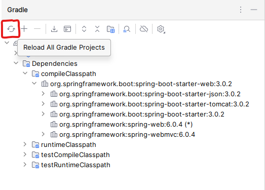
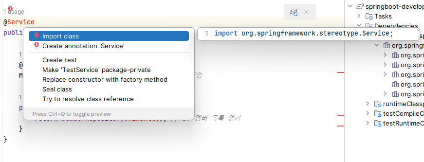
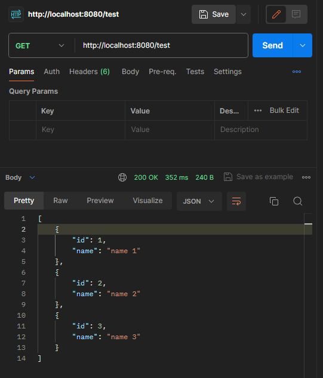

## Table of Contents
- [3장. 스프링 부트 3 구조 이해하기](#3장-스프링-부트-3-구조-이해하기)
  - [3.1 스프링 부트 3 구조 살펴보기](#31-스프링-부트-3-구조-살펴보기)
    - [3.1.1 카페와 빵집으로 이해하는 계층](#311-카페와-빵집으로-이해하는-계층)
      - [**프레젠테이션 계층**](#프레젠테이션-계층)
      - [**비즈니스 계층**](#비즈니스-계층)
      - [**퍼시스턴스 계층**](#퍼시스턴스-계층)
      - [**꼭 알아둘 것.**](#꼭-알아둘-것)
    - [3.1.2 스프링 부트 프로젝트 디렉터리 구성하며 살펴보기](#312-스프링-부트-프로젝트-디렉터리-구성하며-살펴보기)
      - [**`main`**](#main)
      - [**`test`**](#test)
      - [`build.gradle(.kts)`](#buildgradlekts)
      - [`settings.gradle(.kts)`](#settingsgradlekts)
    - [3.1.3 `main` 디렉터리 구성하기](#313-main-디렉터리-구성하기)
  - [3.2 스프링부트 3 프로젝트 발전시키기](#32-스프링부트-3-프로젝트-발전시키기)
    - [3.2.1 build.gradle에 의존성 추가하기](#321-buildgradle에-의존성-추가하기)
    - [3.2.2 프레젠테이션, 서비스, 퍼시스턴스 계층 만들기](#322-프레젠테이션-서비스-퍼시스턴스-계층-만들기)
      - [프레젠테이션 계층 - 컨트롤러: `TestController.java` 내용 수정](#프레젠테이션-계층---컨트롤러-testcontrollerjava-내용-수정)
      - [비즈니스 계층 - 서비스: `TestService.java`](#비즈니스-계층---서비스-testservicejava)
      - [퍼시스턴스 계층 코드: `Member.java`](#퍼시스턴스-계층-코드-memberjava)
        - [매핑 작업](#매핑-작업)
    - [3.2.3 임포트 오류 처리하기](#323-임포트-오류-처리하기)
    - [3.2.4 작동 확인하기](#324-작동-확인하기)
      - [더미 데이터를 넣은 SQL 파일 생성.](#더미-데이터를-넣은-sql-파일-생성)
      - [application.yml 파일](#applicationyml-파일)
      - [테이블 확인](#테이블-확인)
      - [포스트맨으로 HTTP 요청](#포스트맨으로-http-요청)
  - [3.3 스프링 부트 요청-응답 과정 한 방에 이해하기](#33-스프링-부트-요청-응답-과정-한-방에-이해하기)
  - [핵심 요약](#핵심-요약)


# 3장. 스프링 부트 3 구조 이해하기
- **학습 목표**: 스프링 부트 3가 어떤 구조인지, 그리고 어떤 과정을 통해 실행되는지 코드와 함께 살펴봅니다. 여기를 공부하면 스프링 부트 3가 어떤 구조로 이루어져 있고, 앞으로 프로젝트를 진행할 때 어떤 구조로 진행해야 하는지에 대한 감을 잡을 수 있을 겁니다.

- **핵심 키워드**
  - 프레젠테이션 계층
  - 비즈니스 계층
  - 퍼시스턴스 계층


## 3.1 스프링 부트 3 구조 살펴보기
스프링 부트는 각 계층이 양 옆의 계층과 통신하는 구조를 따름. 
- 여기서 계층이라는 것은 각자의 역할과 책임이 있는 어떤 소프트웨어의 구성 요소를 의미함. 
- 각 계층은 서로 소통할 수는 있지만 다른 계층에 직접 간섭하거나 영향을 미치지 않음.

### 3.1.1 카페와 빵집으로 이해하는 계층
어떤 거리에 카페와 빵집이 있다고 가정. 카페는 커피를, 빵집은 빵을 판다. 그런데 필요하다면 협업 관계를 맺어 어떤 손님이 커피를 사면 빵을 할인할 수도 있다. $\rightarrow$ **계층 간 소통**

하지만 빵집 알바생이 빵을 팔다 말고 카페에 가서 커피를 팔 수는 없다.  $\rightarrow$ **즉, 계층은 서로 영향을 끼치지는 못 한다.**

이렇게 각 계층은 자신의 책임에 맞는 역할(커피 팔기, 빵 팔기)을 수행하며, 필요에 따라 소통(커피 사면 빵 할인)을 함.

스프링 부트에는 프레젠테이션, 비즈니스, 퍼시스턴스 계층이 있으며, 이 계층이 서로 통신하며 프로그램을 구성한다.


- [사진 출처](https://velog.io/@beheon/%EC%8A%A4%ED%94%84%EB%A7%81-%EB%B6%80%ED%8A%B83-%EA%B5%AC%EC%A1%B0-)

#### **프레젠테이션 계층**  
HTTP 요청을 받고 이 요청을 비즈니스 게층으로 전송하는 역할. **컨트롤러가 바로 프레젠테이션 계층의 역할을 함**. 컨트롤러는 스프링 부트 내에 여러 개가 있을 수 있음.

#### **비즈니스 계층**  
모든 비즈니스 로직을 처리함. 
- 비즈니스 로직이란 서비스를 만들기 위한 로직을 말합니다. 
- 쉽게 말해 웹 사이트에서 벌어지는 모든 작업, 이를테면 주문 서비스라고 한다면 주문 개수, 가격 등의 데이터를 처리하기 위한 로직, 주문 처리를 하다가 발생하는 예외 처리 로직, 주문을 받거나 최소하는 것 같이 프로세스를 구현하기 위한 로직등을 생각하면 됨. 

**서비스가 비즈니스 계층의 역할을 합니다**.

#### **퍼시스턴스 계층**  
모든 데이터베이스 관련 로직을 처리함. 
- 이 과정에서 데이터베이스에 접근하는 **DAO** 객체 를 사용할 수도 있습니다. **DAO**는 데이터베이스 계층과 상호작용하기 위한 객체라고 이해하면 됩니다. 

**리포지토리가 퍼시스턴스 계층의 역할을 합니다.**

#### **꼭 알아둘 것.**
계층은 개념의 영역이고, 컨트롤러, 서비스, 리포지토리는 실제 구현을 위한 영역이라는 것.

### 3.1.2 스프링 부트 프로젝트 디렉터리 구성하며 살펴보기
정해진 프로젝트 구조는 없지만 추천 구조는 있음!


#### **`main`**
실제 코드를 작성하는 공간입니다. 프로젝트 실행에 필요한 소스 코드나 리소스 파일은 모두 이 폴더 안에 들어 있음.

#### **`test`**
프로젝트의 소스 코드를 테스트할 목적의 코드나 리소스 파일이 들어 있습니다.

#### `build.gradle(.kts)`
빌드를 설정하는 파일입니다. 의존성이나 플러그인 설정 등과 같이 빌드에 필요한 설정을 할 때 사용합니다.

#### `settings.gradle(.kts)`
빌드할 프로젝트의 정보를 설정하는 파일입니다.

### 3.1.3 `main` 디렉터리 구성하기


- templates directory: HTML과 같은 뷰 관련 파일 보관
- static directory: JS, CSS, 이미지와 같은 정적파일을 보관
- application.yml: 스프링 부트 설정을 할 수 있는 파일로 스프링 부트 서버가 실행되면 자동으로 로딩되는 파일. 데이터베이스의 설정 정보, 로깅 설정 정보 등이 들어갈 수도 있고, 직접 설정을 정의할 떄 사용하기도 함

## 3.2 스프링부트 3 프로젝트 발전시키기

### 3.2.1 build.gradle에 의존성 추가하기
`build.gradle.kts` 내용 수정
```kotlin
dependencies {
    // 필요한 기능의 의존성 입력
    implementation("org.springframework.boot:spring-boot-starter-web") // 기본값을 모두 지우고 웹 관련 기능 제공
    testImplementation("org.springframework.boot:spring-boot-starter-test") // 테스트 기능 제공

    // 스프링 데이터 JPA
    implementation("org.springframework.boot:spring-boot-starter-data-jpa")
    runtimeOnly("com.h2database:h2") // 인메모리 데이터베이스
    compileOnly("org.projectlombok:lombok") //롬복
    annotationProcessor("org.projectlombok:lombok")
}
```
스프링 부트용 JPA 인 **스프링 데이터 JPA**, 로컬 환경과 테스트 환경에서 사용할 **인메모리 데이터베이스 H2**, **반복 메서드 작성 작업을 줄여주는 라이브러리인 롬복**을 추가


- 완료 후 reload 눌러주기

### 3.2.2 프레젠테이션, 서비스, 퍼시스턴스 계층 만들기
#### 프레젠테이션 계층 - 컨트롤러: `TestController.java` 내용 수정
```java
package me.younghoon.springbootdeveloper;

import org.springframework.web.bind.annotation.GetMapping;
import org.springframework.web.bind.annotation.RestController;

@RestController
public class TestController {

    @Autowired // TestService 빈 주입
    TestService testService;

    @GetMapping("/test")
    public List<Member> getAllMembers() {
        List<Member> members = testService.getAllMembers();
        return members;
    }
}
```

#### 비즈니스 계층 - 서비스: `TestService.java` 
```java
package me.younghoon.springbootdeveloper;

@Service
public class TestService {

    @Autowired
    MemberRepository memberRepository; // 1. 빈 주입

    public List<Member> getAllMembers() {
        return memberRepository.findAll(); // 2. 멤버 목록 얻기
    }
}
```
1. `MemberRepository` 라는 빈을 주입받은 후
2. `findAll()` 메서드를 호출해 멤버 테이블에 저장된 멤버 목록을 모두 가져옴.


#### 퍼시스턴스 계층 코드: `Member.java`
- DB에 접근할 때 사용할 객체인 Member DAO를 생성하고, 실제 DB에 접근하는 코드 작성하기
```java
package me.younghoon.springbootdeveloper;

@NoArgsConstructor(access = AccessLevel.PROTECTED)
@AllArgsConstructor
@Getter
@Entity
public class Member {
    @Id
    @GeneratedValue(strategy = GenerationType.IDENTITY)
    @Column(name = "id", updatable = false)
    private Long id;  // DB 테이블의 'id' 컬럼과 매칭

    @Column(name = "name", nullable = false)
    private String name; // DB 테이블의 'name' 칼럼과 매칭
}
```
`member`라는 이름의 테이블에 접근하는데 사용할 객체.

실제로 `member` 테이블과 `Member` 클래스를 매핑하는 코드를 작성하기.

##### 매핑 작업 
인터페이스 파일 필요: `MemberRepository.java`
```java
package me.younghoon.springbootdeveloper;

@Repository
public interface MemberRepository extends JpaRepository<Member, Long> {
}
```
이 인터페이스는 DB에서 데이터를 가져오는 퍼시스턴트 계층 역할을 할 겁니다.

- `member`라는 이름의 테이블에 접근해서 `Member` 클래스에 매핑하는 구현체

### 3.2.3 임포트 오류 처리하기
에러 클릭 후 `alt + enter` 필요한 클래스 import하기.  



TestService.java
```java
package me.younghoon.springbootdeveloper;

import org.springframework.beans.factory.annotation.Autowired;
import org.springframework.stereotype.Service;

import java.util.List;

@Service
public class TestService {

    @Autowired
    MemberRepository memberRepository; // 1. 빈 주입

    public List<Member> getAllMembers() {
        return memberRepository.findAll(); // 2. 멤버 목록 얻기
    }
}
```

TestController.java
```java
package me.younghoon.springbootdeveloper;

import org.springframework.beans.factory.annotation.Autowired;
import org.springframework.web.bind.annotation.GetMapping;
import org.springframework.web.bind.annotation.RestController;

import java.util.List;

@RestController
public class TestController {

    @Autowired // TestService 빈 주입
    TestService testService;

    @GetMapping("/test")
    public List<Member> getAllMembers() {
        List<Member> members = testService.getAllMembers();
        return members;
    }
}
```

Member.java
```java
package me.younghoon.springbootdeveloper;

import jakarta.persistence.*;
import lombok.AccessLevel;
import lombok.AllArgsConstructor;
import lombok.Getter;
import lombok.NoArgsConstructor;

@NoArgsConstructor(access = AccessLevel.PROTECTED)
@AllArgsConstructor
@Getter
@Entity
public class Member {
    @Id
    @GeneratedValue(strategy = GenerationType.IDENTITY)
    @Column(name = "id", updatable = false)
    private Long id;  // DB 테이블의 'id' 컬럼과 매칭

    @Column(name = "name", nullable = false)
    private String name; // DB 테이블의 'name' 칼럼과 매칭
}
```

MemberRepository.java
```java
package me.younghoon.springbootdeveloper;


import org.springframework.data.jpa.repository.JpaRepository;
import org.springframework.stereotype.Repository;

@Repository
public interface MemberRepository extends JpaRepository<Member, Long> {
}
```

<details>
<summary> <b> 일일이 import하기 귀찮다. </b> </summary>
<br/>

임포트 문을 일일이 `Alt + Enter`로 삽입하는 과정이 귀찮으면 `Settings > Editors > General > Auto Import > Add unambiguous imports on the fly / Optimize imports on the fly`를 체크하고 [적용] 버튼을 눌러 설정하면 된다.


</details>

### 3.2.4 작동 확인하기
아직은 데이터베이스에 결과물을 볼 수 있는 데이터가 하나도 입력되지 않은 상태입니다. 

보통은 이런 실행 테스트를 하기 위해 애플리케이션을 실행할 때마다 SQL 문을 실행해 데이터베이스에 직접 데이터를 넣는데요, 현재는 인메모리 데이터베이스를 사용하고 있기 떄문에 애플리케이션을 새로 실행할 떄마다 데이터가 사라져 매우 불편합니다. 

이를 해결하기 위해 애플리케이션을 실행할 때 원하는 데이터를 자동으로 넣는 작업을 하겠습니다.

#### 더미 데이터를 넣은 SQL 파일 생성.
```sql
// resources/data.sql
INSERT INTO member (id, name) VALUES (1, 'name 1')
INSERT INTO member (id, name) VALUES (2, 'name 2')
INSERT INTO member (id, name) VALUES (3, 'name 3')
```

#### application.yml 파일
```yml
spring:
  jpa:
    # 전송 쿼리 확인
    show-sql: true
    properties:
      hibernate:
        format_sql: true

    # 테이블 생성 후에 data.sql 실행
    defer-datasource-initialization: true
```
- `show-sql`, `format_sql`: 애플리케이션 실행 과정에 데이터베이스에 쿼리할 일이 있으면 실행 구문을 모두 보여주는 옵션
- `defer-datasource-initialization`: 애플리케이션을 실행할 때 테이블을 생성하고 data.sql 파일에 있는 쿼리를 실행하도록 하는 옵션

`SpringBootDeveloperApplication.java` 파일 탭을 누른 다음 재실행 아이콘 클릭.~

#### 테이블 확인
콘솔창에서 `ctrl + F`를 누르고 `CREATE TABLE`을 검색해 테이블 확인


#### 포스트맨으로 HTTP 요청
포스트맨을 켜고 HTTP 메서드를 [GET] 으로, URL에 http://localhost:8080/test 을 입력하세요.  

그런 다음 [Send] 버튼을 눌러 스프링 부트 서버에 HTTP 요청을 전송하세요. 그러면 좀 전에 data.sql 파일로 작성해 저장한 데이터를 포스트맨, 즉 ,클라이언트에서 확인할 수 있습니다.



포스트맨에서 데이터를 보기까지는 다음 그림과 같은 과정을 거침


- [이미지 출처](https://velog.io/@alstjsdlr0321/03-%EC%8A%A4%ED%94%84%EB%A7%81-%EB%B6%80%ED%8A%B8-3-%EA%B5%AC%EC%A1%B0-%EC%9D%B4%ED%95%B4%ED%95%98%EA%B8%B0)

## 3.3 스프링 부트 요청-응답 과정 한 방에 이해하기

- [이미지 출처](https://velog.io/@summer_today/3.1-%EC%8A%A4%ED%94%84%EB%A7%81-%EB%B6%80%ED%8A%B8-3-%EA%B5%AC%EC%A1%B0)

1. 포스트맨에서 톰캣에 `/test GET` 요청을 합니다. 그러면 이 요청은 스프링 부트 내로 이동함.
2. 이 때 스프링 부트의 **디스패처 서블릿**이라는 녀석이 URL을 분석하고, 이 요청을 처리할 수 있는 컨트롤러를 찾습니다. <br/>TestController가 `/test` 라는 패스에 대한 `GET` 요청을 처리할 수 있는 `getAllMembers()` 메서드를 가지고 있으므로 디스패처 서블릿은 `TestController` 에게 `/test GET` 요청을 전달합니다. 
3. 마침내 `/test GET` 요청을 처리할 수 있는 `getAllMembers()` 메서드와 이 요청이 매치됩니다. 그리고 `getAllMembers()` 메서드에서는 비즈니스 계층과 퍼시스턴스 계층을 통하면서 필요한 데이터를 가져옵니다. 
4. 그러면 **뷰 리졸버**는 템플릿 엔진을 사용해 HTML 문서를 만들거나 JSON, XML 등의 데이터를 생성합니다. 
5. 그 결과 members 를 return 하고 그 데이터를 포스트맨에서 볼 수 있게 됩니다.

## 핵심 요약
일반적으로 스프링 부트 프로젝트는 4개의 계층으로 이루어집니다.

1) **프리젠테이션 계층**은 HTTP 요청을 받고 비즈니스 계층으로 전송합니다.
2) **비즈니스 계층**은 모든 비즈니스 로직을 처리합니다. 퍼시스턴스 계층에서 제공하는 서비스를 사용할 수도 있고, 권한을 부여하거나 유효성 검사를 하기도 합니다.
3) **퍼시스턴스 계층**은 모든 스토리지 관련 로직을 처리합니다. 이 과정에서 데이터베이스에 접근 하기 위한 객체인 DAO 를 사용할 수도 있습니다.