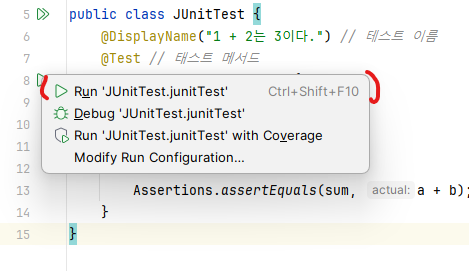
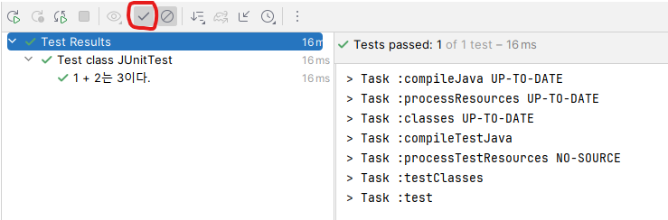

<style>
index {
  font-size:16px;
}
</style>

# 24.02.16


<br/>

- 4장. 스프링 부트 3와 테스트

# 4장. 스프링 부트 3와 테스트
<!-- _class: lead -->

## 학습목표
<!-- _class: lead -->

스프링 부트3에서 테스트 코드를 어떻게 작성하는지 알아보고 실습을 하며 이해합니다.

---
- **핵심 키워드**
  - JUnit
  - AssertJ
  - `@Test`
  - given-when-then

- **진행 순서**
  - 테스트 코드 개념 익히기
  - 스프링 부트 3와 테스트
  - 제대로 테스트 코드 작성해보기

## 4.1 테스트 코드 개념 익히기
**테스트코드:**  
작성한 코드가 의도대로 잘 동작하고 예상치 못한 문제가 없는지 확인할 목적으로 작성하는 코드
- 유지보수에도 매우 좋고, 코드 수정 시 기존 기능이 제대로 작동하지 않을까 봐 걱정하지 않아도 된다는 장점이 있음.

### 4.1.1 테스트 코드란?
- 테스트 코드는 test 디렉터리에서 작업함.  


---
- 테스트 코드에도 다양한 패턴이 있음.
  - 그 중 이번에 사용할 패턴은 __given-when-then__ 패턴.
    1. **given**: 테스트 실행을 준비하는 단계
    2. **when**: 테스트를 진행하는 단계
    3. **then**: 테스트 결과를 머증하는 단계 

---
- __given-when-then__ 패턴 예시
```java
//given-when-then 패턴의 테스트 코드 예
@DisplayName("새로운 메뉴를 저장한다.")
@Test
public void saveMenuTest() {
	// given : 메뉴를 저장하기 위한 준비 과정
    final String name = "아메리카노";
    final int price = 2000;
    
    final Menu americano = new Menu(name, price);
    
    // when : 실제로 메뉴를 저장
    final long savedId = menuService.save(americano);
    
    // then : 메누가 잘 추가되었는지 검증
    final Menu savedMenu = menuService.findById(savedId).get();
    assertThat(savedMenu.getName()).isEqualTo(name);
    assertThat(savedMenu.getPrice()).isEqualTo(price);    
}
```

## 4.2 스프링 부트 3와 테스트
스프링 부트는 애플리케이션을 테스트하기 위한 도구와 애너테이션을 제공함.  

`spring-boot-starter-test` 스타터에 테스트를 위한 도구가 모여 있음.

---

<div style="font-size:30px">

- 스프링 부트 스타터 테스트 목록
  - **JUnit** : 자바 프로그래밍 언어용 단위 테스트 프레임워크
  - **Spring Test & Spring Boot Test** : 스프링 부트 애플리케이션을 위한 통합 테스트 지원
  - **AssertJ** : 검증문인 어설션을 작성하는 데 사용되는 라이브러리
  - **Hamcrest** : 표현식을 이해하기 쉽게 만드는 데 사용되는 Matcher 라이브러리
  - **Mockito** : 테스트에 사용할 가짜 객체인 목 객체를 쉽게 만들고, 관리하고, 검증할 수 있게 지원해주는 테스트 프레임워크
  - **JSONassert** : JSON 용 어설션 라이브러리
  - **JsonPath** : JSON 데이터에서 특정 데이터를 선택하고 검색하기 위한 라이브러리

이 중에서 **JUnit**과 **AssertJ**를 가장 많이 사용함.!

</div>

### 4.2.1 JUnit이란?
자바 언어를 위한 단위 테스트 프레임워크

- 단위 테스트: 작성한 코드가 의도대로 작동하는지 작은 단위로 검증하는 것을 의미(이 때 단위는 보통 메서드가 됨).

---
- JUnit의 특징
  - 테스트 방식을 구분할 수 있는 애너테이션을 제공
  - `@Test` 애너테이셔으로 메서드를 호출할 떄마다 새 인스턴스를 생성, 독립 테스트 가능
  - 예상 결과를 검증하는 어설션 메서드 제공
  - 사용 방법이 단순, 테스트 코드 작성 시간이 적음
  - 자동 실행, 자체 결과를 확인하고 즉각적인 피드백을 제공

#### JUnit으로 단위 테스트 코드 만들기
<!-- _class : lead -->

##### 1. `src > test > java` 폴더에 `JUnitTest.java` 파일을 생성하고 코드 작성해보기

```java
import org.junit.jupiter.api.Assertions;
import org.junit.jupiter.api.DisplayName;
import org.junit.jupiter.api.Test;

public class JUnitTest {
    @DisplayName("1 + 2는 3이다.") // 테스트 이름
    @Test // 태스트 메서드
    public void junitTest() {
        int a = 1;
        int b = 2;
        int sum = 3;

        Assertions.assertEquals(sum, a + b); // 값이 같은지 확인 - (기대값, 검증할 값)
    }
}
```

---
- `@DisplayName` 애너테이션은 테스트 이름을 명시함.
- `@Test` 애너테이션을 붙인 메서드는 테스트를 수행하는 메서드가 됩니다. 

JUnit 은 테스트끼리 영향을 주지 않도록 각 테스트를 실행할 때마다 테스트를 위한 실행 객체를 만들고 테스트가 종료되면 실행 객체를 삭제합니다. 

##### 2. 실제 동작 확인



테스트가 끝나면 콘솔창에 테스트 결과가 출력됩니다. 

---
단, 그림처럼 성공 여부, 테스트 케이스의 이름, 테스트 실행 시간 정보를 확인하기 위해서는 [체크] 버튼을 눌러야 합니다.



---
<details>
<summary> <b> 한글 깨질 때? </b> </summary> <br/>


- 2개 항목을 모두 IntelliJ IDEA로 바꾸기! (책에는 그런데 실제로는 반영이 안 되는..)

</details>

<br/>

##### 3. 테스트가 실패하는 경우?

실패를 위한 테스트 추가
```java
public class JUnitTest {
	//... 생략 ...
    @DisplayName("1 + 3는 4이다.")
    @Test //태스트 메서드
    public void junitFailedTest() {
        int a = 1;
        int b = 3;
        int sum = 3;

        Assertions.assertEquals(sum, a + b); //실패하는 케이스
    }
}
```

---

- `JUnitTest` 자체 실행 시 모든 Test에 대해 결과 확인 가능!

##### 4. JUnit의 애너테이션을 알아보자.
`JUnitCycleTest.java`
- JUnit은 각 테스트에 대해 객체를 만들어 독립적으로 실행함.
- 또한 테스트는 애너테이션에 따라 실행 순서가 정해짐.

---
```java
import org.junit.jupiter.api.*;

public class JUnitCycleTest {
    @BeforeAll //전체 테스트를 시작하기 전에 1회 실행하므로 메서드는 static 으로 선언
    static void beforeAll() {
        System.out.println("@BeforeAll");
    }

    @BeforeEach // 테스트 케이스를 시작하기 전마다 실행
    public void beforeEach() {
        System.out.println("@BeforeEach");
    }

    @Test
    public void test1() {
        System.out.println("test1");
    }

    @Test
    public void test2() {
        System.out.println("test2");
    }

    @Test
    public void test3() {
        System.out.println("test3");
    }

    @AfterAll // 전체 테스트를 마치고 종료하기 전에 1회 실행하므로 메서드는 static 으로 선언
    static void afterAll() {
        System.out.println("@AfterAll");
    }

    @AfterEach // 테스트 케이스를 종료하기 전마다 실행
    public void afterEach() {
        System.out.println("@AfterEach");
    }
}
```

---
- `@BeforeAll`
  - **전체 테스트를 시작하기 전에 처음으로 한 번만 실행함**. <br/>예를 들어 데이터베이스를 연결해야 하거나 테스트 환경을 초기화할 때 사용됩니다. 이 애너테이션은 전체 테스트 실행 주기에서 한 번만 호출되어야 하기 때문에 메서드를 `static`으로 선언해야 합니다.
- `@BeforeEach`
  - **테스트 케이스를 시작하기 전에 매번 실행함**.<br/> 예를 들어 테스트 메서드에서 사용하는 객체를 초기화하거나 테스트에 필요한 값을 미리 넣을 떄 사용할 수 있습니다. 각 인스턴스에 대해 메서드를 호출해야 하므로 매서드는 `static`이 아니어야 합니다.

---
- `@AfterAll`
  - **전체 테스트를 마치고 종료하기 전에 한 번만 실행함**. <br/>에를 들어 데이터베이스 연결을 종료할 대나 공통적으로 사용하는 자원을 해제할 때 사용할 수 있습니다. 전체 테스트 실행 주기에서 한 번만 호출되어야 하므로 메서드를 `static`으로 선언해야 합니다.
- `@AfterEach`
  - **각 테스트 케이스를 종료하기 전 매번 실행함**. <br/> 예를 들어 테스트 이후에 특정 테이터를 삭제해야 하는 경우 사용합니다. `@BeforeEach`와 마찬가지로 메서드는 `static`이 아니어야 합니다.

---
애너테이션을 중심으로 JUnit의 실행 흐름을 살펴보면 다음과 같습니다. `@BeforeEach`부터 `@AfterEach`까지 테스트 개수만큼 반복된 결과물을 볼 수 있음.


- 그림 출처: [링크](https://goldenrabbit.co.kr/2023/06/30/springtest/)

---
<details>
<summary> <b> 한 번만 호출 - static </b> </summary> <br/>


</details>

##### 5. `JUnitCycleTest.java` 결과 확인


---
1. 결과를 보면 `@BeforeAll`로 설정한 메서드가 실행 
<br/>

2. 그 이후에는 테스트 케이스 개수만큼 `@BeforeEach` $\rightarrow$ `@Test` $\rightarrow$ `@AfterEach`의 생명주기로 테스트가 진행
<br/>

3. 모든 테스트 케이스가 끝나면 `@AfterAll` 애너테이션으로 설정한 메서드를 실행하고 종료됨.

#### AssertJ로 검증문 가독성 높이기
<!-- _class: lead -->

---
**AssertJ**는 **JUnit**과 함께 사용해 검증문의 가독성을 확 높여주는 라이브러리
<br/>

아래 코드는 기댓값과 비교값이 잘 비교되지 않음.
```java
// 기댓값과 비교값이 잘 구분되지 않는 Assertion 예
Assertions.assertEquals(sum, a+b);
```

큰 문제라고 생각하지 않을 수 있겠지만 대규모 프로젝트에서는 조금 더 명확한 모습의 코드가 실수를 줄일 수 있어 이런 가독성은 꽤 중요한 문제!!

---
아래 코드는 **AssertJ**를 적용한 코드
```java
// 가독성이 좋은 AssertJ 예
assertThat(a+b).isEqualTo(sum);
```
- 이 경우 a와 b를 더한 값이 sum과 같아야 한다는 의미로 명확하게 읽히기 때문에 코드를 읽는 사람이 헷갈리지 않음!

---
아래 표는 다양한 메서드를 정리한 것.

| **메서드 이름** | **설명** |
| :---: | :---: |
| `isEqaulTo(A)` | A 값과 같은지 검증 |
| `isNotEqaulTo(A)` |A 값과 다른지 검증 |
| `contains(A)` | A 값을 포함하는지 검증 |
| `doesNotContain(A)` | A 값을 포함하지 않는지 검증 |
| `startsWith(A)` | 접두사가 A인지 검증 |
| `endsWith(A)` | 접미사가 A인지 검증 |
| `isEmpty()` | 비어 있는 값인지 검증 |
| `isNotEmpty()` | 비어 있지 않은 값인지 검증 |
| `isPositive()` | 양수인지 검증 |
| `isNegative()` | 음수인지 검증 |
| `isGreaterThan(1)` | 1보다 큰 값인지 검증 |
| `isLessThan(1)` | 1보다 작은 값인지 검증 |

## 4.3 제대로 테스트 코드 작성해보기
<!-- _class: lead -->

### 1단계
TestController.java 파일을 열고 클래스 이름 위에 마우스 커서를 놓고 클릭한 다음 `Alt + Enter`을 누르면 [Create Test]가 나타납니다. [Create Test] 를 누르세요.  

  

---
그러면 Create Test 창이 열리고 [OK] 를 누르면 `TestControllerTest.java` 파일이 `test/java/패키지` 아래에 생성됩니다.

    

### 2단계
다음 코드 작성
```java
import org.junit.jupiter.api.AfterEach;
import org.junit.jupiter.api.BeforeEach;
import org.springframework.beans.factory.annotation.Autowired;
import org.springframework.boot.test.autoconfigure.web.servlet.AutoConfigureMockMvc;
import org.springframework.boot.test.context.SpringBootTest;
import org.springframework.test.web.servlet.MockMvc;
import org.springframework.test.web.servlet.setup.MockMvcBuilders;
import org.springframework.web.context.WebApplicationContext;

import static org.junit.jupiter.api.Assertions.*;
```

---
```java
@SpringBootTest // 테스트용 애플리케이션 컨텍스트 생성
@AutoConfigureMockMvc // MockMvc 생성 및 자동 구성
class TestControllerTest {
    
    @Autowired
    protected MockMvc mockMvc;
    
    @Autowired
    private WebApplicationContext context;
    
    @Autowired
    private MemberRepository memberRepository;
    
    @BeforeEach // 테스트 실행 전 실행하는 메서드
    public void setMockMvcSetUp() {
        this.mockMvc = MockMvcBuilders.webAppContextSetup(context)
                .build();
    }

    @AfterEach // 테스트 실행 후 실행하는 메서드
    public void cleanUp() {
        memberRepository.deleteAll();
    }
}
```

---
- `@SpringBootTest`
  - `@SpringBootTest`는 메인 애플리케이션 클래스에 추가하는 애너테이션인 `@SpringBootApplication`이 있는 클래스를 찾고 그 클래스에 포함되어 있는 빈을 찾은 다음 테스트용 애플리케이션 컨텍스트라는 것을 만듭니다.
- `@AutoConfigureMockMvc`
  - `@AutoConfigureMockMvc`는 MockMvc를 생성하고 자동으로 구성하는 애너테이션입니다. <br/>MockMvc는 애플리케이션을 서버에 배포하지 않고도 테스트용 MVC 환경을 만들어 요청 및 전송, 응답 기능을 제공하는 유틸리티 클래스입니다. 즉, 컨트롤러를 테스트 할 때 사용되는 클래스 입니다.

---
- `@BeforeEach`
  - 테스트를 실행하기 전에 실행하는 메서드에 적용하는 애너테이션입니다. 여기서는 `MockMvcSetUp()`메서드를 실행해 MockMvc를 설정해줍니다.
- `@AfterEach`
  - 테스트를 실행한 이후에 실행하는 메서드에 적용하는 애너테이션입니다. 여기서는 `cleanUp()` 메서드를 실행해 member 테이블에 있는 데이터들을 모두 삭제해줍니다.

### 3단계
그럼 이제 TestController의 로직을 테스트하는 코드를 작성하겠습니다. 같은 파일에 다음 코드를 추가하세요.

---
```java
@SpringBootTest // 테스트용 애플리케이션 컨텍스트 생성
@AutoConfigureMockMvc // MockMvc 생성 및 자동 구성
class TestControllerTest {

	// ... 생략 ...

    @DisplayName("getAllMembers: 아티클 조회에 성공한다.")
    @Test
    public void getAllMembers() throws Exception {
        // given
        final String url = "/test";
        Member savedMember = memberRepository.save(new Member(1L, "홍길동"));

        // when
        final ResultActions result = mockMvc.perform(get(url) // ❶
                .accept(MediaType.APPLICATION_JSON)); // ❷

        // then
        result
                .andExpect(status().isOk()) // ❸
                // ❹ 응답의 0번째 값이 DB에 저장한 값과 같은지 확인
                .andExpect(jsonPath("$[0].id").value(savedMember.getId()))
                .andExpect(jsonPath("$[0].name").value(savedMember.getName()));
    }
}
```

---
- **Given-When-Then 패턴 $\rightarrow$ 의도한 테스트 확인** 
  - **Given:** 멤버를 저장함
  - **When:** 멤버 리스트를 조회하는 API를 호출함
  - **Then:** 응답 코드가 200 OK이고, 반환받은 값 중에 0번째 요소의 id와 name이 저장된 값과 같은지 확인합니다.

---
<div style="font-size:30px">

1. ❶ `perform()` 메서드는 요청을 전송하는 역할을 하는 메서드입니다. 결과로 ResultActions 객체를 받으면 ResultActions 객체는 반환값을 검증하고 확인하는 `andExpect()` 메서드를 제공해줍니다. `andExpect()`에 관한 내용은 ❸ 에서 다루겠습니다.

2. ❷ `accept()` 메서드는 요청을 보낼 때 무슨 타입으로 응답을 받을지 결정하는 메서드입니다. JSON, XML 등 다양한 타입이 있지만, 여기에서는 JSON을 받는다고 명시해두도록 합니다.

3. ❸ `andExpect()` 메서드는 응답을 검증합니다. TestController에서 만든 API는 응답으로 OK(200)을 반환하므로 이에 해당하는 메서드인 isOk 를 사용해 응답 코드가 OK(200) 인지 확인합니다.

4. ❹ `jsonPath("[0].{필드명}")`은 JSON 응갑값의 값을 가져오는 역할을 하는 메서드입니다. 0번쨰 배열에 들어있는 객체의 id, name 값을 가져오고, 저장된 값과 같은지 확인합니다.

</div>

#### HTTP 주요 응답 코드
| 코드 | 매핑 메서드 | 설명 |
| :---: | :---: | :---: |
| 200 OK | `isOk()` | HTTP 응답 코드가 200 OK 인지 검증 |
| 201 Created | `isCreated()` | HTTP 응답 코드가 201 Created인지 검증
| 400 Bad Request | `isBadRequest()` | HTTP 응답 코드가 400 Bad Request인지 검증
| 403 Forbidden | `isForbidden()` | HTTP 응답 코드가 403 Forbidden인지 검증
| 404 Not Found | `isNotFound()` | HTTP 응답 코드가 404 Not Found인지 검증
| 400번대 응답 코드 | `is4xxClientError()` | HTTP 응답 코드가 400번대 응답 코드인지 검증
| 500 Internal Server Error | `isInternalServerError()` | HTTP 응답 코드가 500 Internal Server Error인지 검증 |
| 500번대 응답 코드 | `is5xxServerError()` | HTTP 응답 코드가 500번대 응답 코드인지 검증 |

### 4단계
실제로 테스트가 잘 동작하는지 확인하기.

테스트 파일에 오른쪽 마우스를 클릭하고 [Run 'TestControllerTest'] 를 선택

  

---


---
<details>
<summary> <b> TestControllerTest.java - 코드 오류인데 그냥 되는..?? </b> </summary> <br/>

```java

// ... 생략

    @DisplayName("getAllMembers: 아티클 조회에 성공한다.")
    @Test
    public void getAllMembers() throws Exception {
        // given
        final String url = "/test";
        Member savedMember = memberRepository.save(new Member(1L, "홍길동")); // 'Member()' cannot be applied to '(long, java.lang.String)'

        // when
        final ResultActions result = mockMvc.perform(get(url) // 1
                .accept(MediaType.APPLICATION_JSON)); // 2

        // then
        result
                .andExpect(status().isOk())
                .andExpect(jsonPath("$[0].id").value(savedMember.getId())) // Cannot resolve method 'getId' in 'Member'
                .andExpect(jsonPath("$[0].name").value(savedMember.getName())); // Cannot resolve method 'getName' in 'Member'
    }
}
```

</details>

## 핵심 요약
1) **테스트 코드**를 작성하면 코드의 기능이 제대로 작동한다는 것을 검증할 수 있습니다. <br/>테스트 코드는 보통 테스트를 준비하는 **given**, 테스트를 실제로 진행하는 **when**, 테스트 결과를 검증하는 **then**으로 구분됩니다.
2) **JUnit**은 단위 테스트를 할 때 사용하는 자바 테스트 프레임워크입니다. <br/>`@BeforeAll`로 설정한 메서드가 실행되고, 그 이후에는 테스트 케이스 개수만큼 `@BeforeEach` $\rightarrow$ `@Test` $\rightarrow$ `@AfterEach`의 생명주기를 가지고 실행합니다. 모든 테스트가 완료되면 마지막으로 `@AfterAll`로 설정한 메서드가 실행되고 종료됩니다.
3) **AssertJ**는 JUnit과 함께 사용해 검증문의 가독성을 확 높여주는 라이브러리입니다.

