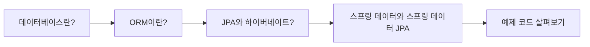
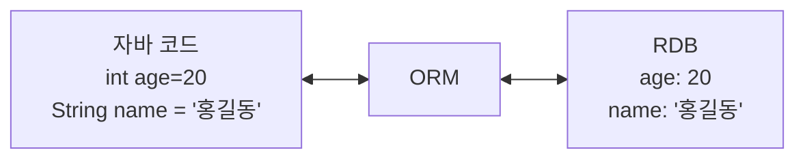
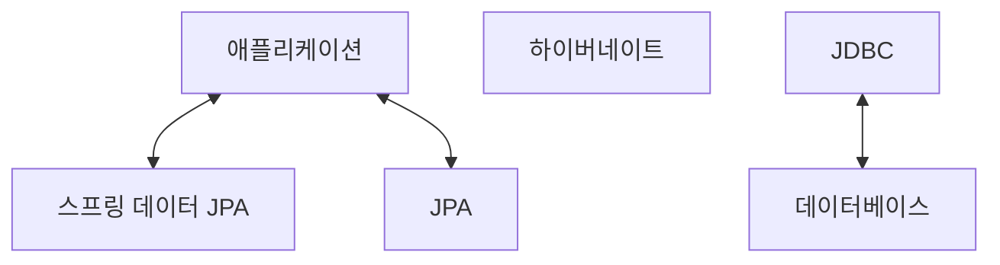

## Table of Contents

# 5장. 데이터베이스 조작이 편해지는 ORM
- **학습 목표**: SQL을 몰라도 데이터베이스를 조작할 수 있게 해주는 편리한 도구인 ORM을 공부하겠습니다. ORM은 SQL공부를 한 적이 있다면 그 편리함을 더 크게 느낄 수 있는 도구인데요, 여기서는 스프링 부트의 ORM 기술 표준인 **스프링 JPA**와 이를 구현하기 위한 **하이버네이트**를 사용합니다.

- **핵심 키워드**
  - DBMS
  - ORM
  - JPA
  - 하이버네이트
  - 엔티티
  - 영속성 컨텍스트
  - 스프링 데이터 JPA



## 5.1 데이터베이스란?
데이터베이스는 데이터를 매우 효율적으로 보관하고 꺼내볼 수 있는 곳입니다. 데이터베이스를 사용하면 얻을 수 있는 가장 큰 이점은 굉장히 많은 사람이 안전하게 데이터를 사용하고, 관리할 수 있다는 것이죠.

### 5.1.1 데이터베이스 관리자 DBMS
이떄 데이터베이스를 관리하기 위한 소프트웨어를 DBMS 
(database management system)라고 합니다. 

데이터베이스는 많은 사람이 공유할 수 있어야 하므로 **동시 접근**을 할 수 있어야 합니다. 이 외에도 많은 요구사항이 있는데요. 

DBMS는 이런 요구사항을 만족하면서도 효율적으로 데이터베이스를 관리하고 운영합니다. 흔히 데이터베이스라고 알고 있는 MySQL, Oracle은 사실 DBMS인 것이죠. 

DBMS는 관리 특징에 따라서 **관계형, 객체-관계형, 도큐먼트형, 비관계형 등으로 분류**합니다. 가장 많이 사용하는 DBMS는 관계형입니다.

#### 관계형 DBMS
관계형 DBMS(relational DBMS, RDBMS)라고 부릅니다.

관계형이라는 말을 쓰는 이유는 이 DBMS가 관계형 모델을 기반으로 하기 떄문인데요. RDBMS는 어렵게 생각할 필요 없이 **테이블 형태로 이루어진 데이터 저장소**를 생각하면 됩니다. 

예를 들어 회원 테이블이 있다고 가정하면 각 행은 고유의 키, 즉, 아이디를 가지고 있고, 이메일, 나이와 같은 회원과 관련된 값들이 들어갑니다.

| ID | 이메일 | 나이 |
| :---: | :---: | :---: |
| 1 | a@test.com | 10 |
| 2 | b@test.com | 20 |
| 3 | c@test.com | 30 |

이때 데이터 1, a@test.com, 10 을 묶어서 한 줄을 **행**이라고 하고, ID, 이메일, 나이와 같은 구분을 **열**이라고 합니다.

#### H2, MySQL
이 책에서 사용할 RDBMS는 **H2, MySQL**입니다. 

H2는 자바로 작성되어 있는 RDBMS입니다. 조금 더 구체적으로 설명하면 스프링 부트가 지원하는 인메모리 관계형 데이터베이스인데요. 

H2는 데이터를 다른 공간에 따로 보관하는 것이 아니라 애플리케이션 자체 내부에 데이터를 저장하는 특징이 있습니다. 그래서 애플리케이션을 다시 실행하면 데이터는 초기화가 되죠. 하지만 간편하게 사용하기 좋아서 개발 시에는 테스트 용도로 많이 사용합니다.

실제 서비스에는 사용하지 않죠. 실제 서비스에는 MySQL과 같은 제품을 많이 사용합니다. 이 책에서도 마찬가지로 개발 시에는 H2를, 실제 서비스로 올릴 때는 MySQL을 사용할 예정입니다.

<details>
<summary> <b> H2, 인메모리 RDBMS </b> </summary> <br/>


</details> <br/>

#### 꼭 알아야 할 데이터베이스 용어
- 테이블(Table): 테이블은 데이터베이스에서 데이터를 구성하기 위한 가장 기본적인 단위입니다. 테이블은 행과 열로 구성되며 행은 여러 속성으로 구성됩니다.
- 행(Row): 행은 테이블의 구성 요소 중 하나이며 테이블의 가로로 배열된 데이터의 집합을 의미합니다.<br/> 예를 들어 회원 테이블이 있따고 할때 ID 가 1번인 회원의 이메일, 나이 같은 정보가 모여 있는 집합이 1번 회원에 대한 행이라고 할 수 있죠. 행은 반드시 고유한 식별자인 기본키를 가집니다. 행을 레코드(record)라고 부르기도 합니다.
- 열(Column): 열은 테이블의 구성 요소 중 하나이며, 행에 저장되는 유형의 데이터입니다. <br/>예를 들어 회원 테이블이 있다고 할 때, 열은 각 요소에 대한 속성을 나타내며 무결성을 보장합니다. 지금의 경우 이메일은 문자열, 나이는 숫자 유형을 가집니다. 이메일 열에 숫자가 들어가거나, 나이 열에 문자열이 들어갈 수 없기 떄문에 데이터에 대한 무결성을 보장합니다.
- 기본키(Primary Key): 기본키는 행을 구분할 수 있는 식별자입니다. 이 값은 테이블에서 유일해야 하며 중복 값을 가질 수 없습니다. 보통 데이터를 수정하거나 삭제하고, 조회할 때 사용되며 다른 테이블과 관계를 맺어 데이터를 가져올 수도 있습니다. 또한 기본키의 값을 수정되어서는 안 되며 유효한 값이어야 합니다. 즉 NULL이 될 수 없습니다.
- Query: 쿼리는 데이터베이스에서 데이터를 조회하거나 삭제, 생성, 수정 같은 처리를 하기 위해 사용하는 명령문입니다. SQL이라는 데이터베이스 전용 언어를 사용하여 작성합니다.


<details>
<summary> <b> 무결성? </b> </summary> <br/>


</details> <br/>


### 5.2 ORM(Object−Relational Mapping)이란?
ORM은 자바의 객체와 데이터베이스를 연결하는 프로그래밍 기법입니다. 

예를 들어 데이터베이스에 age, name 컬럼에 20, 홍길동이라는 값이 들어있다고 생각해보죠. 이것을 자바에서 사용하려면 어떻게 해야 할까요? 

아마 다른 방법이 필요할 겁니다. 보통은 SQL이라는 언어로 데이터를 꺼내 사용하죠. 그러면 SQL을 새로 공부해야 하니 골치가 아픕니다!



**하지만 ORM이 있다면 데이터베이스 값을 마치 객체처럼 사용할 수 있습니다.** 쉽게 말해 SQL을 전혀 몰라도 자바 언어로만 데이터베이스에 접근해서 원하는 데이터를 받아올 수 있죠. 

**즉, 객체와 데이터베이스를 연결해 자바 언어로만 데이터베이스를 다룰 수 있게 하는 도구를 ORM이라고 합니다.** 

ORM은 다음과 같이 장점과 단점이 있습니다.
- 장점
  1. SQL을 직접 작성하지 않고 사용하는 언어로 데이터베이스에 접근할 수 있습니다.
  2. 객체지향적으로 코드를 작성할 수 있기 떄문에 비즈니스 로직에만 집중할 수 있습니다.
  3. 데이터베이스 시스템이 추상화되어 있기 때문에 MySQL에서 PostgreSQL로 전환한다고 해도 추가로 드는 작업이 거의 없습니다. 즉, 데이터베이스 시스템에 대한 종속성이 줄어듭니다.
  4. 매핑하는 정보가 명화하기 때문에 ERD에 대한 의존도를 낮출 수 있고 유지보수할 때 유리합니다.
- 단점
  1. 프로젝트의 복잡성이 커질수록 사용 난이도가 올라갑니다.
  2. 복잡하고 무거운 쿼리는 ORM으로 해결이 불가능한 경우가 있습니다.

## 5.3 JPA(Java persistence API)와 하이버네이트(Hibernate)?
DBMS에도 여러 종류가 있는 것처럼 ORM에도 여러 종류가 있습니다. 자바에서는 **JPA**를 표준으로 사용합니다. 

JPA는 자바에서 관계형 데이터베이스를 사용하는 방식을 정의한 인터페이스인데요, 인테페이스 이므로 실제 사용을 위해서는 ORM 프레임워크를 추가로 선택햐야 합니다. 대표적으로는 **하이버네이트**를 많이 사용하죠. 

하이버네이트는 JPA 인터페이스를 구현한 구현체이자 자바용 ORM 프레임워크입니다. 내부적으로는 JDBC API를 사용하죠. 하이버네이트의 목표는 자바 객체를 통해 데이터베이스 종류에 상간없이 데이터베이스를 자유자재로 사용할 수 있게 하는 데 있습니다.

> JPA와 하이버네이트의 역할
> - JPA(Java Persistence API): 자바 객체와 데이터베이스를 연결해 데이터를 관리합니다. <br/>객체 지향 도메인 모델과 데이터베이스의 다리 역할을 합니다.
> - 하이버네이트(Hibernate) : JPA의 인터페이스를 구현합니다. 내부적으로는 JDBC API를 사용합니다.



### 5.3.1 엔티티 매니저란?
: JPA와 하이버네이트에 대해서 알아보았으니, JPA의 중요한 컨셉 중 하나인 **엔티티 매니저**와 **영속성 컨텍스트**를 알아보겠습니다.

#### 엔티티(Entity)
**엔티티는 데이터베이스의 테이블과 매핑되는 객체를 의미**합니다. 엔티티는 본질적으로 자바 객체이므로 일반 객체와 다르지 않습니다. 

**하지만 데이터베이스의 테이블과 직접 연결된다는 아주 특별한 특징**이 있어 구분지어 부릅니다. 즉, 엔티티는 객체이긴 하지만 데이터베이스에 영향을 미치는 쿼리를 실행하는 객체인 것이죠.

#### 엔티티 매니저(Entity manager)
엔티티를 관리해 데이터베이스와 애플리케이션 사이에서 객체를 생성, 수정, 삭제하는 등의 역할을 합니다.

그리고 이런 엔티티 매니저를 만드는 곳이 엔티티 매니저 팩토리(entity manager factory)입니다. 

앞서 데이터베이스에 여러 사용자가 접근할 수 있다고 했죠? 예를 들어 회원 2명이 동시에 회원 가입을 하려는 경우 엔티티 매니저는 다음과 같이 업무를 처리합니다. 

회원 1의 요청에 대해서 가입 처리를 할 엔티티 매니저를 엔티티 매니저 팩토리가 생성하면 이를 통해 가입 처리해 데이터베이스에 회원 정보를 저장하는 것이죠. 회원 2도 마찬가지입니다. 그리고 회원 1, 2를 위해 생성된 엔티티 매니저는 필요한 시점에 데이터베이스와 연결한 뒤에 쿼리합니다.

그렇다면 스프링 부트에서도 직접 엔티티 매니저 팩토리를 만들어서 관리할까요? 사실 그렇지 않습니다. 스프링 부트는 내부에서 엔티티 매니저 팩토리를 하나만 생성해서 관리하고 `@PersistenceContext` 또는 `@Autowired` 애너테이션을 사용해서 엔티티 매니저를 사용합니다.

```java
// 스프링 부트가 엔티티 매니저를 사용하는 방법 예
@PersistenceContext
EntityManager em; // 프록시 엔티티 매니저. 필요할 때 진짜 엔티티 매니저 호출
```

그리고 스프링 부트는 기본적으로 빈을 하나만 생성해서 공유하므로 동시성 문제가 발생할 수 있습니다. 그래서 **실제로는 엔티티 매니저가 아닌 실제 엔티티 매니저와 연결하는 프록시(가짜) 엔티티 매니저를 사용합니다.** 필요할 때 데이터베이스 트랜잭션과 관련된 실제 엔티티 매니저를 호출하는 겁니다.

> 쉽게 말해 엔티티 매니저는 Spring Data JPA에서 관리하므로 여러분이 직접 생성하거나 관리할 필요가 없습니다.

### 5.3.2 영속성 컨텍스트란?
또한 엔티티 매니저는 엔티티를 영속성 컨텍스트에 저장한다는 특징이 있습니다. 영속성 컨텍스트는 JPA의 중요한 특징 중 하나로, 엔티티를 관리하는 가상의 공간입니다. 이것이 있기 때문에 데이터베이스에서 효과적으로 데이터를 가져올 수 있고, 엔티티를 편하게 사용할 수 있는 것이죠.

영속성 컨텍스트에는 1차 캐시, 쓰기 지연, 변경 감지, 지연 로딩이라는 특징이 있는데요. 이 특징들에 대해서 간단하게 알아보겠습니다.

기존에는 데이터 조작을 위해 쿼리를 직접 작성해야 했지만 스프링 부트에서는 이런 쿼리를 자바 코드로 작성하고 이를 JPA가 알아서 쿼리로 변경해주는 것이 매우 편리합니다. 그래서 어떤 사람들은 JPA의 영속성 컨텍스트를 몰라도 괜찮다고 이야기하기도 합니다. 

하지만 필자는 이를 모르고 지나치면 자신의 의도하지 않은 방향으로 프로그램이 결과를 만들 수 있다고 생각합니다. 그래서 이런 상황을 대비해 영속성 컨텍스트의 기본적인 특징들을 알아 두기를 추천합니다.

#### 1차 캐시
영속성 컨텍스트는 내부에 1차 캐시를 가지고 있습니다. 

이때 캐시의 키는 엔티티의 `@Id` 애너테이션이 달린 기본키 역할을 하는 식별자이며 값은 엔티티입니다. 엔티티를 조회하면 1차 캐시에서 데이터를 조회하고 값이 있으면 반환합니다. 

값이 없으면 데이터베이스에서 조회해 1차 캐시에 저장한 다음 반환합니다. 이를 통해 캐시된 데이터를 조회할 떄에는 데이터베이스를 거치지 않아도 되믈 매우 빠르게 데이터를 조회할 수 있습니다.

#### 쓰기 지연(transactional write-behind)
트랜잭션을 커밋하기 전까지는 데이터베이스에 실제로 질의문을 보내지 않고 쿼리를 모았다가 트랜잭션을 커밋하면 모았던 쿼리를 한번에 실행하는 것을 의미합니다. 

예를 들어 데이터 추가 쿼리가 3개라면 영속성 컨텍스트는 트랜잭션을 커밋하는 시점에 3개의 쿼리를 한꺼번에 쿼리를 전송합니다. 이를 통해 적당한 묶음으로 쿼리를 요청할 수 있어 데이터베이스 시스템의 부담을 줄일 수 있습니다.

#### 변경 감지
트랜잭션을 커밋하면 1차 캐시에 저장되어 있는 엔티티의 값과 현재 엔티티의 값을 비교해서 변경된 값이 있다면 변경 사항을 감지해 변경된 값을 데이터베이스에 자동으로 반영합니다. 

이를 통해 쓰기 지연과 마찬가지로 적당한 묶음으로 쿼리를 요청할 수 있고, 데이터베이스 시스템의 부담을 줄일 수 있습니다.

#### 지연 로딩(lazy loading)
쿼리로 요청한 데이터를 애플리케이션에 바로 로딩하는 것이 아니라 필요할 때 쿼리를 날려 데이터를 조회하는 것을 의미합니다.

---
이 특징들의 갖는 공통적은 모두 데이터베이스의 접근을 최소화해 성능을 높일 수 있다는 겁니다. 캐시를 하거나, 자주 쓰지 않게 하거나, 변화를 자동 감지해서 미리 준비하거나 하는 등의 방법을 통해 말이죠. 이런 특징을 잘 이해하고 JPA를 사용한다면 문제 상황을 조금 더 잘 이해할 수 있을 겁니다.


### 5.3.3 엔티티의 상태
엔티티는 4가지 상태를 가집니다. 
1. 영속성 컨텍스트가 관리하고 있지 않은 분리(detached) 상태 
2. 영속성 컨텍스트가 관리하는 관리(managed) 상태
3. 영속성 컨텍스트와 전혀 관계가 없는 비영속(transient) 상태
4. 삭제된(removed) 상태로 나눠집니다. 

이 상태는 특정 메서드를 호출해 변경할 수 있는데요. 필요에 따라 엔티티의 상태를 조절해 데이터를 올바르게 유지하고 관리할 수 있습니다.

```java
// 엔티티 상태 변경 예
public class EntityManagerTest {
	@Autowired
    EntityManager em;
    
    public void example() {
    	// 1. 엔티티 매니저가 엔티티를 관리하지 않은 상태 (비영속 상태)
        Member member = new Member(1L, "홍길동");
        
        // 2. 엔티티가 관리되는 상태
        em.persist(member);
        // 3. 엔티티 객체가 분리된 상태
        em.detach(member);
        // 4. 엔티티 객체가 삭제된 상태
        em.remove(member);
    }
}
```
1. 엔티티를 처음 만들면 엔티티는 비영속 상태가 됩니다.
2. `persist()` 메서드를 사용해 엔티티를 관리 상태로 만들 수 있으며, `Member` 객체는 영속성 컨텍스트에서 상태가 관리됩니다. 
3. 만약 엔티티를 영속성 컨텍스트에서 관리하고 싶지 않다면 `detach()` 메서드를 사용해 분리 상태로 만들 수 있습니다.
4. 또한 더 이상 객체가 필요 없다면 `remove()` 메서드를 사용해서 엔티티를 영속성 컨텍스트와 데이터베이스에서 삭제할 수 있습니다.

## 5.4 스프링 데이터와 스프링 데이터 JPA
